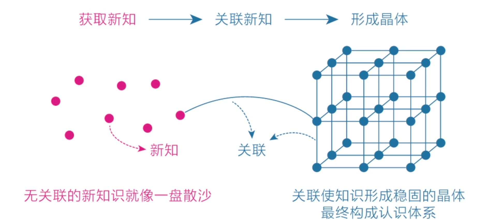

# 认知觉醒

## 上篇 内观自己，摆脱焦虑

### 第一章 大脑--一切问题的起源

#### 第一节 大脑：重新认识你自己

#### 第二节 焦虑：焦虑的根源

#### 第三节 耐心：的耐心者得天下

##### 特性：

- 缺乏耐心是人类的天性

  **人类的特点：**

  1. 在欲望上急于求成
  2. 在行动上避难趋易

- 社会中的精英通常是那些能更好地克服天性的人，他们的耐心水平更高，延迟满足的能力更强。

- 缺乏耐心是因为看不到全局、不知道自己身在何处

  

##### 复利曲线：

前期增长非常缓慢，但到达一个拐点后会飞速增长。

坚信并践行这个价值积累规律，并在积累的过程中遵循刻意练习的原则，在`舒适区边缘`一点一点地扩展自己的能力范围。

##### 舒适区边缘：

拉伸区：是指一个人的知识和技能从已知到未知、从熟悉到陌生的过渡区域。

##### 成长权重对比图：

需要关注改变量

揭示了“学习、思考、行动和改变”在成长过程中的关系。

即对于学习而言，学习之后的思考、思考之后的行动、行动之后的改变更重要，如果不盯住内层的改变量，那么在表层投入再多的学习量也会事倍功半；

学习量焦虑：源于避难趋易，因为，单纯保持学习输入是简单的，而思考、行动和改变则相对困难。

读书时不求记住书中的全部知识，只要有一两个观点促使自己发生了切实的改变就足够了，其收获与意义比读很多书但仅停留在知道的层面要大得多。

##### 学习曲线：

- 平台期：学习进展和时间的关系并不是我们想象中的那种线性关系（学多少是多少），而是呈现一种波浪式上升曲线。

- 认清平台期规律，要有面对长期的冷寂和挫折失败的耐心。
- 关注长远目标。耐心不是毅力带来的结果，而是具有长远目光的结果。

##### 如何拥有耐心：

1. 缺乏耐心是人的天性，坦然接纳；

2. 面对诱惑，学会延迟满足；变对抗为自我沟通引导；（人性：先娱后乐）

3. 遇到困难，改变视角，寻找行动的意义与好处

4. 想办法让本能脑和情绪脑感受到困难事物的乐趣并上瘾，才是理智脑的最高级的策略

   

### 第二章 潜意识-生命留给我们的彩蛋

#### 第一节：模糊

学习知识的目的是“消除模糊”，而获取知识的方法也是“消除模糊”，目的和方法相统一。

提升思考能力的方法正是不断明确核心困难和心得感悟，并专注于此。

痛苦：正视它、看清它、拆解它、化解它。

选择模糊：就是我们在面对众多可能性时无法做出清晰、明确的选择。

人性：人类面对不确定性时会不自觉逃避

#### 第二节：感性

潜意识

先用感性能力帮助自己选择，再用理性能力帮助自己思考。

理性、感性、天性的选择倾向：

只取一个全书最触动自己的点，然后尽可能去实践、改变。这样读书不仅收获更大，而且也不会焦虑。

先用感性选择，再用理性思考

### 第三章 元认知-人类的终极能能力

#### 第一节 元认知

##### 元认知：

对自身的“思考过程”进行认知和理解

元认知能力就是觉察力和自控力的组合；

突出表现是：对模糊零容忍；

##### 普通认知与原认知的区别：

##### **分类：**

- 被动元认知：被外界影响后才开始反思纠正；

- 主动元认知：经常自我反省

当一个人能主动开启第三视角、开始持续反观自己的思维和行为时，就意味着他真正开始觉醒了，他有了快速成长的可能。

##### 作用：

你能意识到自己在想什么，进而意识到这些想法是否明智，再进一步纠正那些不明智的想法，最终做出更好的选择。

##### 元认知的维度：

##### 如何获取元认知能力：

1. 学习前人的智慧和反思自身的经历；
2. 自身的经历更是一种独特的财富；反思复盘；
3. 自我监控，监控注意力，聚焦行动目的；
4. 冥想

#### 第二节 自控力

##### 元时间：

权重比较大的时间为元时间；面临选择时的时间点（想清楚）。

应对陷入模糊状态的策略：在选择的节点审视自己的第一反应，并产生清晰明确的主张。

##### 成为思维舵手有3种方法：

- 针对当下的时间，保持觉知，审视第一反应，产生明确的主张；

- 针对全天的日程，保持清醒，时刻明确下一步要做的事情；

- 针对长远的目标，保持思考，想清楚长远意义和内在动机。

**高尔基曾经说：**每一次克制自己，就意味着比以前更强大。

## 下篇 外观世界，借力前行

### 第四章 专注力

#### 第一节 情绪专注

身体感受永远是进入当下状态的最好媒介，而感受事物消失的过程更是一种很好的专注力训练。

身心合一的要领不仅是专注于当下，更是享受当下。

##### 注意力分类：

1. 集中在行动上

2. 集中在感受上

   

##### 分神的原因：

本质：逃避

1. 觉得当下太无聊，所以追求更有意思的事情
2. 觉得当下太痛苦，于是追求更舒适的事情

##### 解决：

让感受回归行动。

#### 第二节 学习专注

##### 正确的方法：

1. 有定义明确的目标

   ​	目标定义明确；不以时间、不易次数为目标，以结果或效果为目标。

2. 练习时极度专注

   ​	思绪做到清醒切换，保持专注其一

3. 能获得有效的反馈

   ​	避免闭门造车。

4. 始终在拉伸区练习

   ​	跳出舒适区，避开困难区，处在拉伸区。

##### 专注模式：

##### 刻意练习四要素：

---

### 第五章 学习力

#### 第一节 匹配

让自己保持在自己能力范围内的拉伸区域，去做练习。

既不要太难，也不要太容易，难易适中的地带才是学习的心流通道。

#### 第二节 深度

“教”是最好的“学”。

正确的行动往往是反天性的，让你觉得舒服和容易的事往往得不到好结果，而一开始你认为难受和困难的事才能让你真正产生收获。

人与人之间的差距不是来自年龄，甚至不是来自经验，而是来自经验总结、反思和升华的能力。

深度之下的广度才是有效的。

专注于深度学习，同时对浅学习保持开放。

##### 深度学习：

逼迫自己获取高质量的知识以及深度缝接新知识，再用自己的语言或文字教授他人，是为深度学习之道。

##### 学习分类：

1. 被动学习

   ​	如听讲、阅读、视听、演示，这些活动对学习内容的平均留存率为5%、10%、20%和30%。

2. 主动学习

   ​	如通过讨论、实践、教授给他人，将被动学习的内容留存率提升到50%、75%和90%。

##### 深度学习 3 个步骤：

1. 获取高质量的知识；
2. 深度缝接新知识；
3. 输出成果去教授。

一是尽可能获取并亲自钻研一手知识

二是尽可能用自己的话把所学的知识写出来

三是反思生活

##### 人的能力：

1. 知识：最不具迁移能力；医学博士可能不会做麻婆豆腐。
2. 技能：技能通常由70%的通用技能和30%的专业技能组成，迁移性要好一些。
3. 才干：才干层面，职业之间的界限就完全被打破了。

​												---《你的生命有什么可能》

**才干**：我的理解是掌握多种能力进而融会贯通。

#### 第三节 关联

关联是种底层能力，它不仅体现在高层，也体现在低处，与人们的日常生活息息相关。

我们在关联时，需要牢牢聚焦自身最迫切的需求，换句话说，就是让一切与自己有关。

知识的获取不在于多少，而在于是否与自己有关联，以及这种关联有多充分。

但凡收获一个感悟、了解一个观点或是学到一个知识，只要触动了自己，就要想办法让它效率最大化，而效率最大化的办法就是主动关联到别处，并让自己的行动发生改变。

一切在于主动，关联需要主动去运用挖掘。

##### 读书关联的三步骤：

1. 用自己的语言重述信息，即找到触动自己的信息点；
2. 描述自己的相关经验，即关联生活中的其他知识；
3. 我的应用，即转化为行动，让自己切实改变。

##### 深度学习的三个层次：

- 知道信息点

- 关联信息点

- 行动和改变

关联：

##### 获取关联能力：

1. 对某件事拥有热情，专注和思考
2. 输出足够多：多走走、多看看，多阅读、多反思。人生没有白走的路，每一步都算数。
3. 保持好奇心
4. 反问自己，这个道理还能用在什么地方？

#### 第四节 体系

体系的本质就是用独特的视角将一些零散的、独立的知识、概念或观点整合为应对这个世界的方法和技巧。

如何建立个人的知识体系。

知识不一定能给我们带来认知能力，而认知能力必然包含有效的知识。

知识体系不求完整，不痴迷于全盘接收，全盘照搬往往不合身，只求符合当下匹配区。

##### 知识与认知的区别：

知识：只有当知识能够帮助你做实际决策的时候，它才是你的知识。

个人理解的区别：

- 知识：个人知识体系，能解决自己问题的知识；再个人成长领域，只有最适合当前状态的认知。

- 认知：学术知识体系，就是我们所学知识；

  

##### 知识体系分类：

1. 学术知识体系：知道和理解

2. 个人知识体系：运用解决自己的选择与判断，解决实际问题

   

##### 个人成长的目的：

个人成长的目的已经不是“知道和理解”了，而是“判断与选择”。

##### 认知圈：

##### 体系知识如何筛选：

1. 触动是最好的筛选器（改变量）；

   - 真触动：与自己的认知圈建立强连接。

   - 伪触动：与自己的认知圈，连接的不紧密。

     

   

##### 有效关联新知识的三个方面：

对伪触动的解释；

1. 用自己的语言重新解释新知识，这会促使自己原有的知识体系对新知识做出反应；
2. 在需要的时候能够顺利提取知识，提取不出来的知识就是伪触动。
3. 在生活中能够经常练习或使用这些知识，因为实践是产生强关联的终极方法。

#### 第五节 打卡

强大的天性会迫使理性接受“谎言”。

##### 打卡常见的现象：

1. 强大的天性会迫使理性接受“谎言”
2. 学习动机发生转移
3. 降低行动的效能

##### 打卡心态：

1. 学不到，假装一下；学到了，立即停止。

   ​	降低了主动性与热情。

##### 任务心态：

1. 可能会造成对学习活动的厌恶

   ​	应该集中心力做眼前的事就好

##### 认知闭合需求：

就是指当人们面对一个模糊的问题时，就有给问题找出一个明确的答案的欲望。

##### 任务闭合需求：

将`认知闭合需求`扩展到行为上：一件事若迟迟没有完成，心里就总是记挂，期盼着早点结束；此事一旦完成，做这件事的动机就会立即趋向于零。

##### 解决：

1. 用记录代替打卡，降低任务感；重点放在活动收获本身。
2. 设置下限，不设上限。规避任务闭合。

#### 第六节 反馈

所有痛苦都是上天给我们的成长提示。

真正的学习成长不是“努力，努力再努力”，而是“反馈，反馈再反馈”

##### 获得反馈的方式：

1. 产出作品，获得反馈
2. 自我测试

##### 应对“痛苦”的反馈：

自己分享作品后收到的批评或嘲笑该怎么办？

自信受到打击怎么办？

1. 分享不是随意分享半成品，而是尽最大力气将作品打磨成自己当前能力范围内可完成的最好的样子。
2. 制定分享策略，展示给那些能力不及你的人。
3. 冷静客观地对待打击。

#### 第七节 休息

主动休息！

从不过度消耗自己，只要感到精力不足，就停下来主动休息，这反而使他们精力桶的水位得到快速回升。

科学模式：极度专注+主动休息。

高效学习的关键在于保持极度专注，而不是靠意志力苦苦支撑。

---

### 第六章 行动力

#### 第一节 清晰

清晰：就是把目标细化、具体化的能力——行动力只有在清晰力的支撑下才能得到重构。

规划的目的并不是让自己严格地按计划执行，而只是为了让自己心中有数。

你陷入怠惰、懒散、空虚的情绪中动弹不得时，往往是因为你的大脑处于模糊状态。

《系统之美》 -- 德内拉·梅多斯

##### 增强回路：

在初始阶段，强迫自己先做重要的事情，一旦进入正向的增强回路，你便能拥有强大的行动力——这正是增强自制力、提升行动力的秘密。

##### 建立清晰力：

#### 第二节 傻瓜

有理有据保证行动方向的正确性，实践中保持思考，行动验证理论，不是责改，适则用。

##### 认知层次：

- 下一个认知层次的人往往看不到上一个认知层次的风景，因而只能用狭隘的视角来判断。

- 处于高层次的人和处于低层次的人对同一个问题的态度往往有天壤之别

现实结果才是最好的“评判师”。

##### “做到”和“想要”的怪圈：

##### 突破阈值：

我们要专注、要持续行动，直到突破阈值。

#### 第三节 行动

认知上的巨人，行动上的矮子。

真正的捷径正是那条看起来漫长且低效的行动之路。

##### 技能学习路径：

### 第七章 专注力

### 第八章 专注力