## 策略:

- 定投:

- 基金排行:

- 价值投资:

  ```
  自下而上:判断当前价值,低位买入
  
  绝对表现:
  风险规避:
  ```

  

- 最热板块:

## 系统 风险:

- 政治风险
- 经济周期风险
- 利率风险
- 通胀风险
- 流动性风险

规避方法:

```
股票基金 与 债券基金 分持;
```


## 非系统性风险

- 经营风险
- 操作以技术风险
- 管理风险
- 未知价风险
- 信用风险

规避方法:

```
1.购买不同类型基金
2.同类型的 购买不同时段 类别 排序
```

基金排名

```
http://fund.eastmoney.com/company/default.html
```

## 货币基金

类似余额宝

1. 买不带A,B的有优势
2. 用钱荒时,收益率高;
3. 周五不申购,周四部赎回

```
http://fund.eastmoney.com/company/default.html
选择:
1.评级高;
2.利率高;
3.成立年限长;
```


## 债券基金

### 分类:

```
1. 利率债;
2. 信用债;

1. 短期;
2. 长期;

纯债
偏债

```

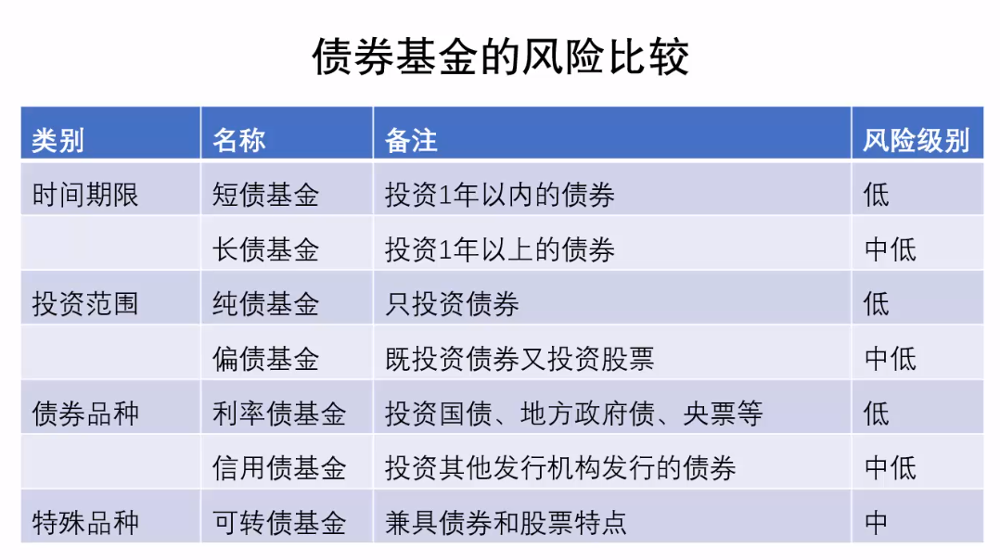

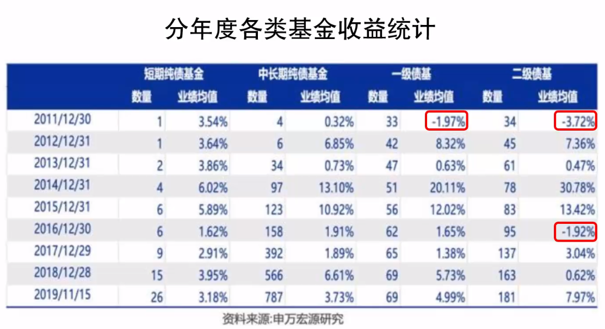

### 筛选

```
http://fund.eastmoney.com/data/fundranking.html
排名:多时段排名第一;

剔除:
1.基金经理三年内有变动;
2.暂无评级的基金;
3.小公司的基金;
```

## 混合基金

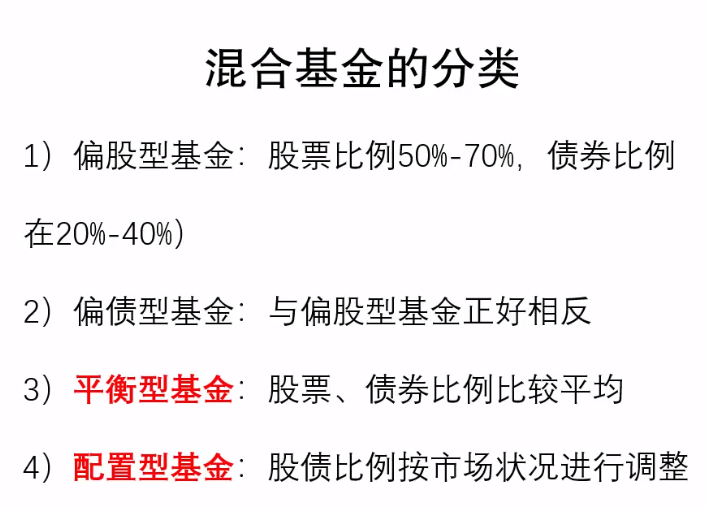

### 筛选

```
1.搜索平衡:关键字; 股票50%,债券50%;
2.查看资产配置;占比:股票60%-80%;债券:40%-20%;偏股;
3.基金评级,公司评级,基金经理评级;
```

## 股票基金

### 筛选

```
1.最大回撤小;2.波动率;小3.夏普比率:大4.规模大于10亿;
```

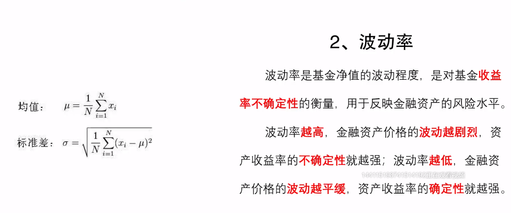

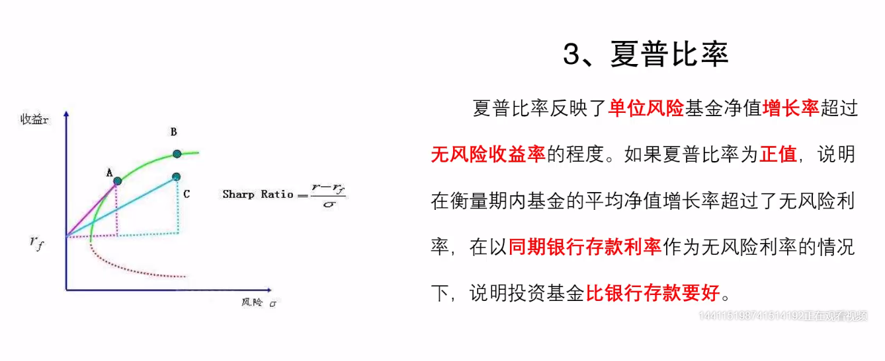

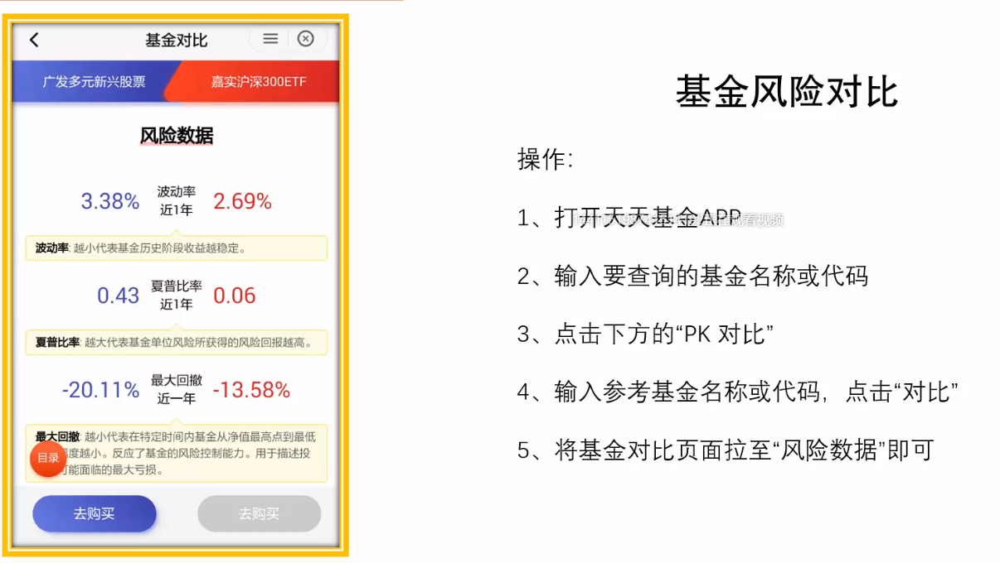

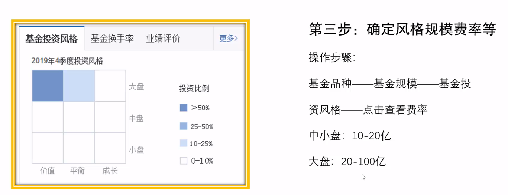

### 投资点:

理杏仁网站

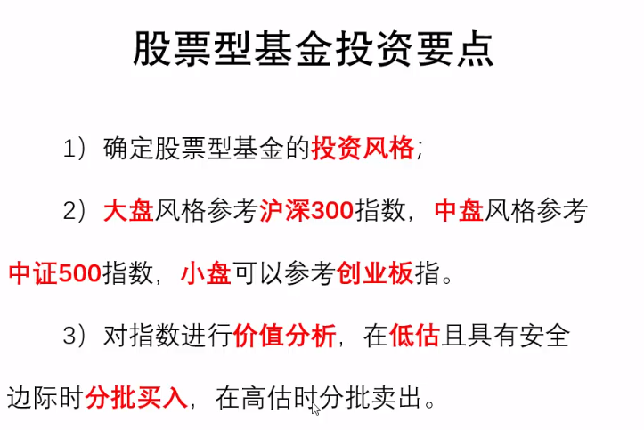

## 指数基金

数据

```
https://www.lixinger.com/analytics/index/sh/000300/300/detail/value
```


### 类别:

```
行业指数:
宽基指数:部分行业
```


### 筛选

```
1.先选指数: 中证指数 国证指数
2.基金规模越大越好,小于1亿剔除;
3.收益误差越小越好,误差大无法达到跟踪目的;
```

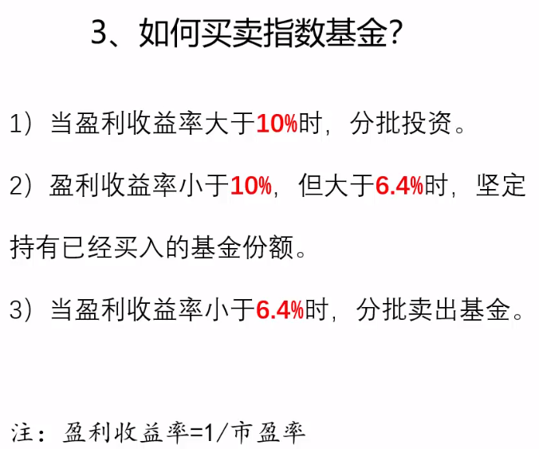

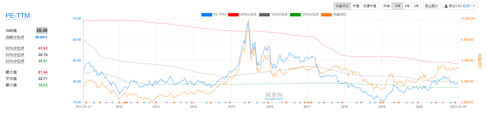

小于绿线时买,大于

## 估值:

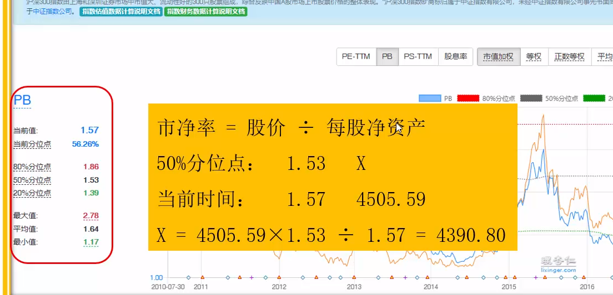

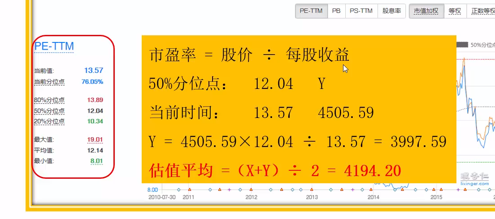

