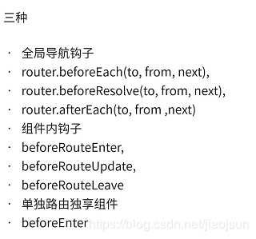

# VUE-Router 路由

官方地址:https://router.vuejs.org/zh/guide/#html

安装:npm install --save vue-router

```js
总结:
this.$router.push({path:'/login'}) //进行编程式路由跳转
<router-link to="/login"> //中的to属性进行路由切换
<router-view />  用于展示
this.$route.params 获取路由传递参数
this.$route.query	获取路由传递参数
5.params和query都是传递参数区别在于params不会再url上显示出现，
query则是我们通常看到的url后面跟上的？后跟的显示参数
```

```js
// 路由重复点击异常处理
const originalPush = Router.prototype.push
Router.prototype.push = function push(location) {
  return originalPush.call(this, location).catch(err => err)
}
```


## vue-router路由

```js
Vue-Router 是vue官方的路由管理器。
通过路由地址的变换展现不同的页面;
路由导航有两种:
	声明式导航:router-link
    编程式导航:router.push(path:'url')

通过:router-view标签作为 页面展示区;

```


## 1.组件导航创建 


```html
<div id="app">
  <h1>Hello App!</h1>
  <p>
    <!-- 使用 router-link 组件来导航. -->
    <!-- 通过传入 `to` 属性指定链接. -->
    <!-- <router-link> 默认会被渲染成一个 `<a>` 标签 -->
    <router-link to="/foo">Go to Foo</router-link>
    <router-link to="/bar">Go to Bar</router-link>
  </p>
  <!-- 路由出口 -->
  <!-- 路由匹配到的组件将渲染在这里 -->
  <router-view></router-view>
</div>
```

```js
// 1. 定义 (路由) 组件。
// 可以从其他文件 import 进来
const Foo = { template: '<div>foo</div>' }
const Bar = { template: '<div>bar</div>' }

// 2. 定义路由
const routes = [
  { path: '/foo', component: Foo },
  { path: '/bar', component: Bar }
]

// 3. 创建 router 实例，然后传 `routes` 配置
// 你还可以传别的配置参数, 不过先这么简单着吧。
const router = new VueRouter({
  routes // (缩写) 相当于 routes: routes
})

// 4. 创建和挂载根实例。
// 记得要通过 router 配置参数注入路由，
// 从而让整个应用都有路由功能
const app = new Vue({
  router
})

// 带/则会当做根路径  不带/则会一直嵌套路径
```

独文件写法

```js
`router/index.js`

import Vue from 'vue'
import VueRouter from 'vue-router'

const routes = [
  { path: '/foo', component: Foo },
  { path: '/bar', component: Bar }
]

const router = new VueRouter({
  routes // (缩写) 相当于 routes: routes
})

router.beforeEach(to,from,next){ }

exprot defalute router
```

```js
`main.js`

import router from  './router/index.js'

new Vue({
    render: h => h(App),
    router,
    store
}).$mount('#app')
```


## 2.传参方式

```js
一、
this.$router.push({ path: '/news', query: { userId: 123 }});
接收方式:{{this.$route.query.userId}}

二、
this.$router.push({ name: 'news', params: { userId: 123 }});
接受方式:{{this.$route.params.userId}}

三、 
	传参:
router.push({path: '/foo/' + 'aaaa'})
const routes = [{path: '/foo/:id',component: Foo}]
const routes = [{path: '/foo/:id/:name',component: Foo}] //多个参数
	接收: console.log(this.$route.params.id) //输出aaaa
	接受：this.$router.params

四、prop解耦传参;
    routes:[
        {
        path:'login/:id',
        props:true,
        component:login
        },{
        path:'login/:id',
        props:{
        	id:5,
            age:6
        },
        component:login 
        }
    ]
	接收方式:
    export default {
        name:'login',
        props:['id','age'],
        mounted(){
            console.log(this.id)
            console.log(this.age)
        }
    }
五、指定固定参数
	{
        path:'login/:id',
        props:(route)=>({
            id:route.query.a,
            age:route.query.b
        })
        component:login
     }
地址:localhost:8080/home/?a=1&b=2
 export default {
        name:'login',
        props:['a','b'],
        mounted(){
            console.log(this.a)
            console.log(this.b)
        }
    }

```

>总结
>
>```js
>总结：
>1.params传递参数，需要使用name进行路由跳转，否则无法传递。
>2.params传递参数刷新会丢失数据，/router/:id方式上的id除外
>3.query显示拼接在url上，刷新不丢失，不是必须有，router/:id方式则必须有id参数，否则无法正确进入视图。
>4.props也可以传递参数，但传递的只能是静态参数。
>```
>
>

## 3.children-子路由

```js
子路由
routes:[{
	path:'/index',
	component:template1,
	name:'templatel',
	children:[
        {
          	path:'son',
			component:'son'
        }，
        {
        	path："/son",
        	component:'xxx'
        }
	]
}]

子路由带‘/’与不带‘/’区别：
带‘/’：路由会解析为 baseUrl/son；
不带’/‘：路由会解析为：baseUrl/index/son
```

## 4.导航守卫

```js
导航守卫主要用来通过跳转或取消的方式守卫导航
全局的, 单个路由独享的, 或者组件级的。

全局路由:
router.beforeEach((to, from, next) => {
  // ...去到每个路由之前执行
    next()//放行
    
})

router.afterEach( (to,from) => {
    当进到某个路由后触发的
} )


组件内的导航  
beforeRouteLeave(to,from,next){
    
}
```

### 全局守卫

```js
全局前置守卫
router.beforeEach((to, from, next) => {
  // ...
})

全局解析守卫
router.beforeResolve

全局后置钩子
router.afterEach((to, from) => {
  // ...
})
```

### 路由独享守卫

```js
const router = new VueRouter({
  routes: [
    {
      path: '/foo',
      component: Foo,
      beforeEnter: (to, from, next) => {
        // ...
      }
    }
  ]
})
```

### 组件内守卫

```js
const Foo = {
  template: `...`,
  beforeRouteEnter (to, from, next) {
    // 在渲染该组件的对应路由被 confirm 前调用
    // 不！能！获取组件实例 `this`
    // 因为当守卫执行前，组件实例还没被创建
       next(vm => {
    // 通过 `vm` 访问组件实例
  })
  },
    
    
  beforeRouteUpdate (to, from, next) {
    // 在当前路由改变，但是该组件被复用时调用
    // 举例来说，对于一个带有动态参数的路径 /foo/:id，在 /foo/1 和 /foo/2 之间跳转的时候，
    // 由于会渲染同样的 Foo 组件，因此组件实例会被复用。而这个钩子就会在这个情况下被调用。
    // 可以访问组件实例 `this`
  },
    
    
`这个离开守卫通常用来禁止用户在还未保存修改前突然离开。该导航可以通过 next(false) 来取消。`
    
  beforeRouteLeave (to, from, next) {
    // 导航离开该组件的对应路由时调用
    // 可以访问组件实例 `this`
  }
}
```

### 	路由解析流程

```js
1、导航被触发
2、在失活的组件里调用离开守卫 beforeRouterleave
3、调用全局的 beforeEach 守卫
4、在重用的组件里调用 beforeRouteUpdate 守卫
5、在路由配置里调用 beforEnter //路由独享
6、解析异步路由组件
7、在被激活的组件里调用 beforeRouteEnter
8、调用全局的 beforeResolve 守卫
9、导航被确认
10、调用全局的 afterEach 钩子
11、触发 DOM 更新
12、在创建好的实例调用 beforeRouteEnter 守卫中传给 next 的回调函数


```

  

#### 全局守卫

- router.beforeEach   全局前置守卫 

  ```js
  const router = new VueRouter({ ... })
    router.beforeEach((to, from, next) => {
    // ...
  })
  ```

  `to: Route:`即将要进入的目标 路由对象

  `from: Route:` 当前导航正要离开的路由

  next: Function:`一定要调用该方法来`resolve`这个钩子。执行效果`依赖 next 方法的调用参数。

- router.beforeResolve 全局解析守卫

  ```js
  在导航被确认之前，同时在所有组件内守卫和异步路由组件被解析之后，解析守卫就被调用。
  ```


    -  router. afterEach 全局后置钩子
    
    ```js
    不会接受 next 函数也不会改变导航本身：
    router.afterEach((to, from) => {
      // ...
    })
    ```


​    

#### 路由独享守卫

-  beforeEnter  

```js
const router = new VueRouter({
  routes: [
    {
      path: '/foo',
      component: Foo,
      beforeEnter: (to, from, next) => {
        // ...
      }
    }
  ]
})
```


#### 组件内守卫

-  beforeRouteEnter  不能获取组件实例this;next(vm=>{可获取实例})
-  beforeRouteUpdate  
-  beforeRouteLeave 

```js
const Foo = {
  template: `...`,
  beforeRouteEnter (to, from, next) {
    // 在渲染该组件的对应路由被 confirm 前调用
    // 不！能！获取组件实例 `this`
    // 因为当守卫执行前，组件实例还没被创建
  },
  //不过，你可以通过传一个回调给 next来访问组件实例。
  //在导航被确认的时候执行回调，并且把组件实例作为回调方法的参数。
  beforeRouteEnter (to, from, next) {
    next(vm => {
      // 通过 `vm` 访问组件实例
    })
  },
  beforeRouteUpdate (to, from, next) {
    // 在当前路由改变，但是该组件被复用时调用
    // 举例来说，对于一个带有动态参数的路径 /foo/:id，在 /foo/1 和 /foo/2 之间跳转的时候，
    // 由于会渲染同样的 Foo 组件，因此组件实例会被复用。而这个钩子就会在这个情况下被调用。
    // 可以访问组件实例 `this`
  },
    
    //  该组件离开跳转到另外的组件时触发该钩子,常应用于用户表单，当用户填了一部分内容，需要提醒用户是否离开页面
 beforeRouteLeave(to, from, next){
  beforeRouteLeave (to, from, next) {
    // 导航离开该组件的对应路由时调用
    // 可以访问组件实例 `this`
  }
}
```

#### vue-router是如何响应 路由参数变化的:

```js
https://blog.csdn.net/weixin_41639609/article/details/88721627 
watch: {
    '$route' (to, from) {
      // 对路由变化作出响应...
    }
  }
```

```js
 beforeRouteUpdate (to, from, next) {
    // react to route changes...
    // don't forget to call next()
  }
```

#### $route和$router的区别

```
答：$route是“路由信息对象”，包括path，params，hash，query，fullPath，matched，name等路由信息参数。而$router是“路由实例”对象包括了路由的跳转方法，钩子函数等。
```

## 5.路由的原理

#### abstract模式:

```js
服务器端和Node.js. 如果没有浏览器API，路由器将自动强制进入此模式
```

#### hash模式

```html
1.就是指 url 尾巴后的 # 号以及后面的字符, 
	请求的时候不会被包含在 http 请求中 只会携带#之前的，
	所以每次改变hash不会重新请求加载页面
2.hash 改变会触发 hashchange 事件
3.hash变化会被浏览器记录，浏览器的前进和后退都能用。
3.能兼容到ie8

监听事件:hashchange事件

https://developer.mozilla.org/zh-CN/docs/Web/API/Location
```

##### 实现:

```js
class Router {
  constructor() {
    this.routes = {};
    this.currentUrl = '';
  }
  route(path, callback) {
    this.routes[path] = callback || function() {};
  }
  updateView() {
    this.currentUrl = location.hash.slice(1) || '/';
    this.routes[this.currentUrl] && this.routes[this.currentUrl]();
  }
  init() {
    window.addEventListener('load', this.updateView.bind(this), false);
    window.addEventListener('hashchange', this.updateView.bind(this), false);
  }
}
```

```html
<div id="app">
  <ul>
    <li>
      <a href="#/">home</a>
    </li>
    <li>
      <a href="#/about">about</a>
    </li>
    <li>
      <a href="#/topics">topics</a>
    </li>
  </ul>
  <div id="content"></div>
</div>
<script src="js/router.js"></script>
<script>
  const router = new Router();
  router.init();
  router.route('/', function () {
    document.getElementById('content').innerHTML = 'Home';
  });
  router.route('/about', function () {
    document.getElementById('content').innerHTML = 'About';
  });
  router.route('/topics', function () {
    document.getElementById('content').innerHTML = 'Topics';
  });
</script>
```


#### history模式

```js
1.页面请求时会带上整个链接，所以后台需要做相对处理，不然返回404
2.不带#号,请求时是整个链接,所以需要服务器的支持把所有路由都重定向到根页面
3.怕刷新,刷新请求,需要服务端配合;

以下会触发popstate:
1.点击浏览器的前进或后退按钮
2.点击 a 标签
3.在 JS 代码中触发 history.push(replace)State 函数


监听事件:popstate

history.pushState({},null,url); 
	1.pushState url变化,页面不会刷新;只有back,forward,go会;
	2.遵守同源策略;
history.replaceState()
history.back()
history.forward()
history.go()
```

##### 实现:

```js
class Router {
  constructor() {
    this.routes = {};
    this.currentUrl = '';
  }
  route(path, callback) {
    this.routes[path] = callback || function() {};
  }
  updateView(url) {
    this.currentUrl = url;
    this.routes[this.currentUrl] && this.routes[this.currentUrl]();
  }
  bindLink() {
    const allLink = document.querySelectorAll('a[data-href]');
    for (let i = 0, len = allLink.length; i < len; i++) {
      const current = allLink[i];
      current.addEventListener(
        'click',
        e => {
          e.preventDefault();
          const url = current.getAttribute('data-href');
          history.pushState({}, null, url);
          this.updateView(url);
        },
        false
      );
    }
  }
  init() {
    this.bindLink();
    window.addEventListener('popstate', e => {
      this.updateView(window.location.pathname);
    });
    window.addEventListener('load', () => this.updateView('/'), false);
  }
}
```

```html
<div id="app">
  <ul>
    <li><a data-href="/" href="#">home</a></li>
    <li><a data-href="/about" href="#">about</a></li>
    <li><a data-href="/topics" href="#">topics</a></li>
  </ul>
  <div id="content"></div>
</div>
<script src="js/router.js"></script>
<script>
  const router = new Router();
  router.init();
  router.route('/', function() {
    document.getElementById('content').innerHTML = 'Home';
  });
  router.route('/about', function() {
    document.getElementById('content').innerHTML = 'About';
  });
  router.route('/topics', function() {
    document.getElementById('content').innerHTML = 'Topics';
  });
</script>
```


## 6.-属性

### router

- route为当前路由对象
- router为VueRouter的实例

```js
1.$router.path   //当前路由的路径
2.$router.replace() //
3.$router.go(Number) //
4.$router.back()  //
5.$router.resolve('/login',this.$route,append=true/false)
{
  location: Location;
  route: Route;
  href: string;
} = router.resolve(loction,current?,append?)
```

```js
解决$router.push()不能打开新页面
let routeData = this.$router.resolve({ path: '/reportpreview', query: { id: id } });

window.open(routeData.href, '_blank');
```


### route

```js
1.$route.params  //参数对象 动态片段和全匹配片段的键值对
2.$route.query   //路由中参数的键值对
3.$route.matched //当前匹配的路径中所包含的所有片段所对应的配置参数对象
4.$route.name    //路径的名字，如果没有使用具名路径
```

## 7.router-link的props属性

#### 1.to

```js
<router-link :to="‘home‘">Home</router-link>

<router-link :to="{ path: ‘home‘ }">Home</router-link>

//命名路由
<router-link :to="{ name: ‘user‘, params: {userId: 123} }">Home</router-link>

//带查询参数，下面的结果为/register?plan=private-->
<router-link :to="{ path: ‘register‘, query: {plan: ‘private‘}}">Register</router-link>
```

#### 2.replace

```js
<router-link :to="{path: ‘/abc‘}" replace>ABC</router-link>

会调用roter.replace()
```

#### 3. append 

```js
<router-link to="b" append>Home</router-link>

设置append属性后，则在当前路径前添加基路径；
如：当前路由为/index；则如上为/index/b
```

#### 4. tag 

```js
<router-link to="/foo" tag="li">FOO</router-link>
// 渲染结果 
<li>FOO</li>

指定<router-link>渲染成某标签；
```

#### 5.active-class

```js
export default New Router({
   linkActiveClass: ‘active‘ 
})

设置链接激活时使用的css类名。默认值可以通过路由的构造选项linkActiveClass来全局配置, 默认值为 ‘router-link-active‘
```

#### 6.exact

```js
"是否激活"，默认是false 。举个粟子，如果当前的路径是/a 开头的，那么<router-link to="/a"> 也会被设置css类名

　　按照这个规则，<router-link to="/"> 将会点亮各个路由！想要链接使用"exact匹配模式"，则使用exact属性：
  
// 这个链接只会在地址为 / 的时候被激活 
<router-link to="/" exact>Home</router-link>

<router-link to="/user">USER</router-link>

<router-link to="/user/userinfo">USER-info</router-link>

// 如果不设置exact，则当路由到了/user/userinfo 页面时，USER也是被设置了router-link-active样式的！
```

#### 7.events

　　声明可以用来触发导航的事件（默认是‘click‘）。可以是一个字符串或者是一个包含字符串的数组

#### 8、将"激活时的css类名"应用在外层元素

　　有时候我们要让"激活的css类名"应用在外层元素，而不是<a\>标签本身，那么可以用<router-link\>渲染外层元素，包裹着内层的原生<a\>标签

```js
<router-link tag="li" to="/foo">
    <a\>/foo</a\>
</router-link>
//在这种情况下，<a\>将作为真实的链接（能获取到正确的href的），而"激活时的css类名"则设置到外层的<li\>
```


## 8.写法

```js
正常写法:

import login from '@/views/login'
{
    path:'/login',
    component:login
   	name:login
};

写法二:
const login = ()=> import('./login')  //异步加载
{
    path:'/login',
    component:login
   	name:login
};

写法三:
{
    path:'/login',
    component:()=>import('@/views/login'), //异步加载
   	name:login
};


```

## 9.路由登陆判断

```js
routes:
[
   {
      path: '/cinema',
      redirect: '/page/cinema',
      component: BlankLayout,
      meta: { title: '影院' , requiresAuth: true}
      children: [
        {
          path: '/cinema/plan',
          name: 'cinemaPlan',
          component: () => import('./views/cinema/Plan'),
          meta: { title: '影院排期' }
        },
        {
          path: '/cinema/cinemaDetail',
          name: 'cinemaDetail',
          component: () => import('./views/cinema/CinemaDetail'),
          meta: { title: '影院详情' }
        }
       ]
    }
]
```

```
引入
import Vue from  'vue'
import VueRouter from 'vue-router'
Vue.use(VueRouter)

const router  = new VueRouter({ routes })

export router
```

```js
to.meta && (typeof to.meta.title !== 'undefined' && setDocumentTitle(`${to.meta.title}`))
  if (to.matched.some(record => record.meta.requiresAuth)) {
    // this route requires auth, check if logged in
    // if not, redirect to login page.
    if (!store.getters.token) {
      next({
        path: '/login',
        query: { redirect: to.fullPath }
      })
    } else {
      if (to.query.siteCode) {
        next()
        return
      }
      if (from.query.siteCode) {
        const query = JSON.parse(JSON.stringify(to.query))
        query.siteCode = from.query.siteCode
        next({
          path: to.path,
          query: query
        })
      } else {
        next() // 确保一定要调用 next()
      }
    }
　}
2.主要说明下为什么要使用遍历to.matched数组判断meta的requiresAuth字段，而不直接使用to.meta.requiresAuth来判断，首先例子当中给的是cinema,也即是1级路由设置了requiresAuth.而cinemaPlan没有设置。假设两种情况：

　前提：vue路由匹配时会同时匹配满足情况的所有路由，即如果路由是‘/cinema/plan’的话，‘/cinema’也会触发。另外如果较高等级的路由需要登录控制的话，它所有的嵌套路由都是基本需要登录控制的。

（1）cinema具有登录控制，而cinemaPlan 没有。如果用户正常点击路由跳转的话，它必然是先进一级路由，再去二级路由，一级路由实现登录控制，利用to.meta是能够满足的，注意这里是用户正常点击，但是假如有用户直接改变url地址的话去访问cinemaPlan的话，则需要给cinemaPlan路由添加requiresAuth字段，同理也需要给cinemaDetail添加字段，如果路由比较多的话，就会很麻烦。

（2）cinema没有登录控制，而cinemaPlan有。这种情况确实不怕用户直接改变url访问二级路由了，但是同样如果过多二级路由，也是需要设置许多requiresAuth。

   所以，为了方便，直接遍历to.matched数组，该数组中保存着匹配到的所有路由信息。就该例而言，访问cinema时，matched数组长度为1，访问cinemaPlan时，matched数组长度为2，即保存着‘/cinema’以及‘/cinema/plan’。其实啰嗦了这么多，直接使用to.meta判断字段也可以，就是需要给所有需要控制的路由添加requiresAuth。而to.matched则只需要给较高一级的路由添加requiresAuth即可，其下的所有子路由不必添加。


```

>some()
>
>```js
>to.matched.some(record => record.meta.requiresAuth)
>some() 方法用于检测数组中的元素是否满足指定条件（函数提供）
>some() 方法会依次执行数组的每个元素
>
>some( ) 不会对空数组进行检测。
>some( ) 不会改变原始数组。
>```
>
>

## 10.路由跳转打开新页面方法

```js
方法1
<router-link target="_blank" :to="{path:'/home',query:{id:'1'}}">新页面打开home页</router-link>

方法2:
 let routeUrl = this.$router.resolve({
     path: "/share",
     query: {id:96}
   });
   window.open(routeUrl.href, '_blank');

```


# 路由 生命周期 动画钩子 顺序

```js
进入首页的钩子们

    1 路由钩子 路由跳转前beforeEach

    2 路由钩子 home组件内部：守卫执行前beforeRouteEnter

    3.路由钩子 路由跳转后afterEach

    4 生命周期 home beforeCreate 创建前状态

    5 生命周期 home created 创建完毕状态

    6 生命周期 home beforeMount 挂载前状态

    7 动画钩子 beforeEnter

    8 生命周期 home mounted 挂载结束状态

    9 动画钩子 enter

    10 动画钩子 afterEnter


离开首页，进入别的页面 other

    1 路由钩子 home 导航离开该组件beforeRouteLeave

    2 路由钩子 路由跳转前beforeEach

    3 路由钩子 other组件内部：守卫执行前beforeRouteEnter

    4.路由钩子 路由跳转后afterEach

    5 生命周期 other beforeCreate 创建前状态

    6 生命周期 other created 创建完毕状态

    7 生命周期 other beforeMount 挂载前状态

    8 动画钩子 beforeEnter 
    9 动画钩子 beforeLeave

    10 动画钩子 leave

    11 动画钩子 afterLeave

    12 生命周期 home beforeDestroy 销毁前状态

    13 生命周期 home destroyed 销毁完成状态

    14 生命周期 other mounted 挂载结束状态

    15 动画钩子 enter

    16 动画钩子 afterEnter
```

