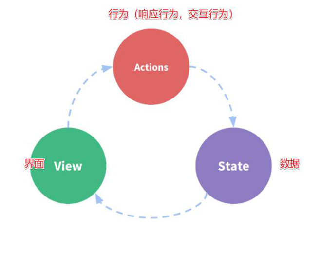

# VUE-Vuex 状态管理

```js
安装:npm install vuex --save

https://router.vuejs.org/zh/api/#路由对象
```

```
页面通过mapAction异步提交事件到action。action通过commit把对应参数同步提交到mutation。 mutation会修改state中对应的值。 最后通过getter把对应值跑出去，在页面的计算属性中通过mapGetter来动态获取state中的值;
```

vuex持久化

```js
 localStorage.getItem("store") && this.$store.replaceState(Object.assign(this.$store.state, JSON.parse(localStorage.getItem("store"))));

    localStorage.clear()

    //在页面刷新时将vuex里的信息保存到localStorage里
    window.addEventListener("beforeunload", () => {
      localStorage.setItem("store", JSON.stringify(this.$store.state))
    })
```


## 1.创建:

```js
src文件下创建 store文件夹
import Vue from 'vue'
import Vuex from 'vuex'

Vue.use(Vuex);

const store = new Vuex.Store({
    state: {	//状态
        userInfo: {
            name: '',
            photo:''
        }
    },    
    
    mutations: { //方法,
        utationA(state,user) {
            state.userInfo.name = user.name
            state.userInfo.photo = user.photo
        }
    },
    
    actions:{ //放异步方法
        actionevent(context){
          //context上下文 为store对象 
          // context.commit, context.state, context.getters, context,.dispatch
        }
        //或
        actionevent({commit}){ // 解构写法
    		commit('utationA')
		}
    },
    
    computed:{ //解决引用繁长,调用直接用计算属性{{name}}
        name(){
            return this.$store.state.userInfo.name
        },
        
        // 需引入:import { mapGetters } from 'vuex'
        ...mapGetters([
            'namelen' //调用{{namelen}},调用getters中的namelen计算方法
        ]),
        // 对象写法,改变名称
        ...mapGetters({
            newName:'namelen' //调用{{namelen}},调用getters中的namelen计算方法
        })
    },
    // 
    getters:{ //调用:$store.getters.namelen
        namelen(state){
            return ...
        }
    },
    
	
});

export default store;
```

#### 组件分发方式

```js
this.$store.commit('xxx')	// 分发mutations
this.$store.dispatch('xxx') // 分发action

map分发:
import { mapState, mapActions,mapMutations } from 'vuex'
 computed: {
        ...mapState({ //将state映射 为 计算属性
            lang: state => state.lang,
            theme: state => state.theme
            homemodule: state=> state.Home.homemodule
            //命名空间写法 
            //模块中写入 namespaced: true,
        })
    },
    methods: {
        ...mapActions(['increment','increment2'])
        ...mapActions({
            login: 'auth/loginByEmail',
            loadLang: 'loadLang'
       }),
    }
//调用用 this.login
```


## 2.main.js

```js
import store from './store'
new Vue({
    render: h => h(App),
    router,
    store  //挂载
}).$mount('#app')
```

## 3.其他文件引用

```js
js调用:
this.$store.state.name='jack' //不建议,因无记录
如但文件导入则只需store
this.$store.commit("userChange",this.form) 

html引用:
{{$store.state.userInfo.name}}
{{name}} //计算属性引用
```

>这个状态自管理应用包含以下几个部分：
>
>- **state**，驱动应用的数据源；
>- **view**，以声明方式将 **state** 映射到视图；
>- **actions**，响应在 **view** 上的用户输入导致的状态变化。
>
>以下是一个表示“单向数据流”理念的简单示意：



## 4.模块化结构-项目结构

```
└── store
    ├── index.js          # 我们组装模块并导出 store 的地方
    ├──	state.js		  		# 根级别的 mutation
    ├── mutations.js      # 根级别的 mutation 同步事件
    ├── actions.js        # 根级别的 action   异步事件
    └── modules
        ├── cart       	  # 购物车模块文件夹
        ├── products   	  # 产品模块文件夹
        └── index.js
```

>├──index.js
>
>>```js
>>import Vue from 'vue'
>>import Vuex from 'vuex'
>>import vuexModules from './modules'
>>import state from './state'
>>import mutations from './mutations'
>>import actions from './actions'
>>
>>Vue.use(Vuex)
>>
>>export default new Vuex.Store({
>>	state,
>>	mutations,
>>	actions,
>>	modules: vuexModules
>>})
>>```
>
>├──	state.js
>
>>```js
>>export default {
>>lang: '',
>>}
>>```
>
>├── mutations.js
>
>```js
>export default {
>  setLang(state, data){
>
>  },
>}
>```

>├── actions.js
>
>```js
>export default {
>loadLang({dispatch, commit, state}, lang) {
>           commit('addLangPack', lang) //commit触发mutations
>           dispatch('loadLang', i18n.fallbackLocale)  //dispatch触发 actions
>loadLang(context, lang) {
>		context.commit('addLangPack', lang) //commit触发mutations
>		context.dispatch('loadLang', i18n.fallbackLocale)  //dispatch触发 actions
>}
>```

>└── modules
>
>>├──m1文件夹
>
>>>├──m1.js
>
>>>```js
>>>const state = {
>>>cachePage: false,
>>>}
>>>const mutations = {
>>>	addTagNav(state, data){
>>>	}
>>>}
>>>
>>>export default {
>>>namespaced: true,
>>>	state,
>>>	mutations
>>>}
>>>```
>
>>index.js
>
>>```js
>>import user from './m1.js'
>>import tagNav from './tagNav'
>>export default {
>>	user: user,
>>	tagNav: tagNav
>>}
>>```
>


## 5.命名空间

默认情况下，模块内部的 action、mutation 和 getter 是注册在**全局命名空间**的。

注意：SET_A_name 命名不可用。

```js
未命名写法: 
...mapState({
      homename: "homename",
      homemodule: state=> state.Home.homemodule
    })
...mapMutations({
      SET_homeName: "SET_homeName",
      SET_homemodule: "SET_homemodule" //直接使用
    }),
```

当模块被注册后，它的所有 getter、action 及 mutation 都会自动根据模块注册的路径调整命名。

#### 命名空间写法

1. 写法-1-

```js
modules: {
    moduleA: {
      namespaced: true, //指定为命名空间
      state:{}
    }

...mapState({
      homename: "homename",
      homemodule: state=> state.Home.homemodule
    })
...mapMutations({
      SET_homeName: "SET_homeName",
      SET_homemodule: "moduleA/SET_homemodule"
    }),
    
 -写法-2-

```

2. 写法-2	

```js
computed: {
  ...mapState('moduleA', {
    a: state => state.a,
    b: state => state.b
  })
},
methods: {
  ...mapActions('moduleA', [
    'foo', // -> this.foo()
    'bar' // -> this.bar()
  ])
}
```

3. 写法-3

```js
import { createNamespacedHelpers } from 'vuex'

const { mapState, mapActions } = createNamespacedHelpers('some/nested/module')

export default {
  computed: {
    // 在 `some/nested/module` 中查找
    ...mapState({
      a: state => state.a,
      b: state => state.b
    })
  },
  methods: {
    // 在 `some/nested/module` 中查找
    ...mapActions([
      'foo',
      'bar'
    ])
  }
}
```


#### 在带命名空间的模块内访问全局内容

1. 希望使用全局 state 和 getter，`rootState` 和 `rootGetters` 会作为第三和第四参数传入 getter，也会通过 `context` 对象的属性传入 action。
2. 若需要在全局命名空间内分发 action 或提交 mutation，将 `{ root: true }` 作为第三参数传给 `dispatch` 或 `commit` 即可。

```js
modules: {
  foo: {
    namespaced: true,

    getters: {
      // 在这个模块的 getter 中，`getters` 被局部化了
      // 你可以使用 getter 的第四个参数来调用 `rootGetters`
      someGetter (state, getters, rootState, rootGetters) {
        getters.someOtherGetter // -> 'foo/someOtherGetter'
        rootGetters.someOtherGetter // -> 'someOtherGetter'
      },
      someOtherGetter: state => { ... }
    },

    actions: {
      // 在这个模块中， dispatch 和 commit 也被局部化了
      // 他们可以接受 `root` 属性以访问根 dispatch 或 commit
      someAction ({ dispatch, commit, getters, rootGetters }) {
        getters.someGetter // -> 'foo/someGetter'
        rootGetters.someGetter // -> 'someGetter'

        dispatch('someOtherAction') // -> 'foo/someOtherAction'
        dispatch('someOtherAction', null, { root: true }) // -> 'someOtherAction'

        commit('someMutation') // -> 'foo/someMutation'
        commit('someMutation', null, { root: true }) // -> 'someMutation'
      },
      someOtherAction (ctx, payload) { ... }
    }
  }
}
```

#### 在带命名空间的模块注册全局 action

1. 若需要在带命名空间的模块注册全局 action，你可添加 `root: true`，并将这个 action 的定义放在函数 `handler` 中。例如：

```js
{
  actions: {
    someOtherAction ({dispatch}) {
      dispatch('someAction')
    }
  },
  modules: {
    foo: {
      namespaced: true,
      actions: {
        someAction: {
          root: true,
          handler (namespacedContext, payload) { ... } // -> 'someAction'
        }
      }
    }
  }
}
```

#### 模块自动注册

```js
import Vue from 'vue'
import Vuex from 'vuex'
Vue.use(Vuex);

const context = require.context('./modules', false, /\.js$/);
const moduleStores = {};
context.keys().forEach(key => {
    const fileName = key.slice(2, -3);
    const fileModule = context(key).default;
    moduleStores[fileName] = {
        ...fileModule,
    };
});

const store = new Vuex.Store({
    modules: {
        ...moduleStores,
    },
    state: {
        curcity: {
            province: '广东省',
            provinceId: 440000,
            city: '深圳',
            cityId: 440300,
            cityshortnamepinyin: 'sz'
        },
        sessionCallBack: ''
    },
    mutations: {},
    actions: {}
})
export default store
```


## 6.刷新事件beforunload解决持久化

持久化插件:

```js
https://github.com/robinvdvleuten/vuex-persistedstate
npm install --save vuex-persistedstate

import Vue from 'vue'
import Vuex from 'vuex'
import createPersistedState from "vuex-persistedstate"
Vue.use(Vuex)

export default new Vuex.Store({
  state: {
    name:'walle',
    routeInfo:'',
    age:'18888888888888'
  },
  mutations: {
  },
  actions: {
  },
  modules: {
  },
  plugins: [createPersistedState({
    storage: window.localStorage,
    key:'store',
    reducer(state) { //指定需要持久化state
      return {
      // 只储存state中的assessmentData
      assessmentData: state.age
     }
     }
  })]
})
```

刷新

```js
created(){
    window.localStorage.getItem('store') && this.$store.replaceState(Object.assign({},this.$store.state,JSON.parse(localStorage.getItem('store'))))

    //window.localStorage.clear() 防止用户看到 或 加密
    
    // window.addEventListener('beforeunload',()=>{
    window.addEventListener('pagehide',()=>{ //移动端beforeunload不生效 代替方案
      localStorage.setItem('store',JSON.stringify(this.$store.state))
    })
  }
```

