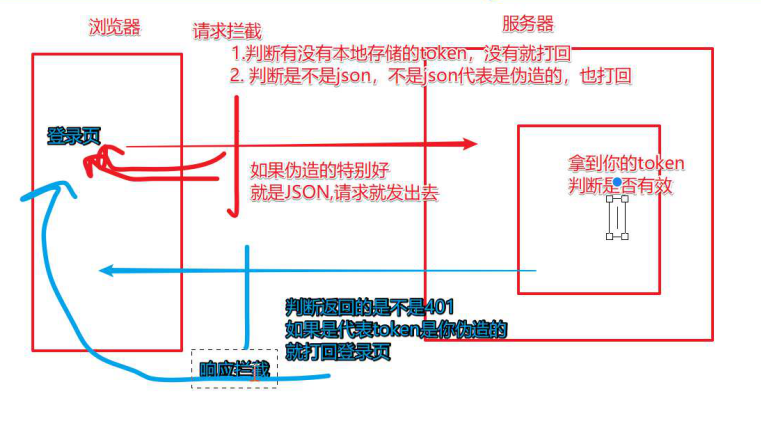

# VUE-Axios

> 官方网址: http://www.axios-js.com/zh-cn/docs/
>
> 安装: npm install --save axios vue-axios
>
> vue专注于网路请求的一个轻量库,没有dom的功能操作
> 需要导包
> 使用箭头函数,this指向vue
>
> https://www.cnblogs.com/chaoyuehedy/p/9931146.html

### axios与ajax

```js
axios 对原生XHR的封装,是一个基于 Promise 的http请求库，可以用在浏览器和node.js中.
1.从 node.js 创建 http 请求
2.支持 Promise API
3.自动转换 JSON 数据
3.客户端支持防止CSRF
4.提供了一些并发请求的接口

这个支持防止CSRF其实挺好玩的，是怎么做到的呢，就是让你的每个请求都带一个从cookie中拿到的key, 根据浏览器同源策略，假冒的网站是拿不到你cookie中得key的，这样，后台就可以轻松辨别出这个请求是否是用户在假冒网站上的误导输入，从而采取正确的策略。

Axios既提供了并发的封装，也没有下文会提到的fetch的各种问题，而且体积也较小，当之无愧现在最应该选用的请求的方式。

ajax：
本身是针对MVC的编程,不符合现在前端MVVM的浪潮
基于原生的XHR开发，XHR本身的架构不清晰，已经有了fetch的替代方案
JQuery整个项目太大，单纯使用ajax却要引入整个JQuery非常的不合理（采取个性化打包的方案又不能享受CDN服务

axios：
从 node.js 创建 http 请求
支持 Promise API
客户端支持防止CSRF
提供了一些并发请求的接口（重要，方便了很多的操作）
```


```js
axios.get('url',{
    headers:{ //设置请求头
        `Bearer $(res.token)`
    },
    params:{//geturl不传参,可在此写参
         page:page,
    }
}).then((backdata)=>{
	
   
}).catch((err)=>{

})

axios.post('url',{
	key:'',//post请求参数
	info:''//post请求参数
}).then((backdata)=>{

}).catch((err)=>{

})
    
修改axios获取的返回数据
axios.defaults.transformResponse=[
    function(data){
        try{
           return JSONbig.parse(data);
        }catch(error){
            return data;
        }finally{
            不管有没有错都会执行这个  
        }
    }
]
    
多并发:
    
function getUserAccount() {
  return axios.get('/user/12345');
}
 
function getUserPermissions() {
  return axios.get('/user/12345/permissions');
}
axios.all([getUserAccount(), getUserPermissions()])
  .then(axios.spread(function (acct, perms) {
    // 两个请求现在都执行完成
  }));
```

### axiso引用方式

#### 	1.绑定原型方式:

```js
axios是一个库，并不是vue中的第三方插件，使用时不能通过Vue.use()安装插件，需要在原型上进行绑定：
安装:npm install --save axios

mian.js文件中:

import Vue from 'vue'
import axios from ‘axios’
Vue.prototype.$http = axios //用法:axios
//或 Vue.prototype.$axios = axios//用法:this.$axios

用法:
axios.get('url?id=123456').then(response=>{

}).catch(error=>{

});
axios.get('url',{
	parms:{
		id:123456
	}
}).then(response=>{

}).catch(error=>{

});
```

#### 2.插件方法

```js
vue-axios是将axios集成到Vue.js的小包装器，可以像插件一样进行安装
安装:npm install --save axios vue-axios  

import Vue from 'vue'
import axios from 'axios'
import VueAxios from 'vue-axios'

Vue.use(VueAxios, axios)

用法:
Vue.axios.get('url').then((response)=>{});
this.axios.get('url').then((response)=>{});
this.$http.get('url').then((respose)=>{});
```

#### 3.接口封装方式

```js
import axios from 'axios'
export const http = axios.create({
    baseURL:'http://ttapi.research.itcast.cn'
})

1.接口方式:
export const login = (data)=>{
    return http.post('/app/v1_0/authorizations',data)
}

2.接口类型方式:
export const postRequests = (url, params) => {
      return service({
            method: 'post',
            url: url,
            data: params,
            headers: {
                  'Authorization': getStore("Authorization") || '',
                  'schoolCode': getStore('schoolCode')
            }
      });
};

	引入:
import {postRequests} from './api'
export const postFind = (params) => {
   return postRequests('/travelPlanWeb', params)
}
>>>>>>>>>>>>>>>>>>^^^^
```

```js
import axios from 'axios'
var baseUrl = ''
// var version = '1.0.1'
// 环境判断
if (process.env.NODE_ENV === 'development') {
  // baseUrl = 'http://192.168.8.32:8082/'
} else if (process.env.NODE_ENV === 'test') {
  baseUrl = 'test'
} else if (process.env.NODE_ENV === 'production') {
  baseUrl = 'prodction'
}

// http://localhost:9010/department/querySubDepar
let axi = axios.create({
  baseUrl: baseUrl,
  timeOut: 8000,
  headers: {
    'Content-Type': 'application/json; charset=UTF-8'
  }
})
var getData = (params) => {
  return axi.get(params.url).then(response => {
    params.success && params.success(response.data)
  }).catch((error) => {
    params.fail && params.fail(error)
  })
}
let postData = (refs) => {
  // 判断是否有数据 转换为表单数据
  var formData = new FormData()
  if (refs.data) {
    for (var key in refs.data) {
      formData.append(key, refs.data[key])
    }
    refs.data = formData
  }
  return axi({
    method: 'post',
    url: refs.url,
    data: refs.data,
    headers: {
            'Content-Type': 'application/json; charset=UTF-8'
        }
  }).then(res => {
    refs.success && refs.success(res.data)
  }).catch(error => {
    refs.fail && refs.fail(error)
  })
}
export {postData, getData}
```


#### 4.多基地址

```js
import axios from 'axios'

let http = axios.create({
    baseURL:'基地址'
})


export const axiosA = axios.create({
	baseURL:"http://www.a.cn"
})
export const axiosb = axios.create({
	baseURL:"http://www.b.cn"
})


调用:按名导入
import { axiosA } from "地址"
```

```js
创一个文件:utils>http>index.js
`js`
import axios from 'axios'
export const http = axios.create({
    baseURL:'http://ttapi.research.itcast.cn'
})

接口方式:
export const login = (data)=>{
    return http.post('/app/v1_0/authorizations',data)
}

`vue`
import { login } from 'diz'
async loging(){
    let res = await login(data);
    console.log(res);
}

```


### axios全局配置

```js
axios.defaults.timeout = 15000;  //超时响应
axios.defaults.headers.post['Content-Type'] = 'application/x-www-form-urlencoded'; // 配置请求头（推荐）
// axios.defaults.headers.post['Content-Type'] = 'application/json;charset=utf-8'; // 配置请求头
axios.defaults.baseURL = $core.use('http'); //确认协议和地址
axios.defaults.withCredentials = true;   // axios 默认不发送cookie，需要全局设置true发送cooki
axios.defaults.headers.common['Authorization'] = AUTH_TOKEN;
```

### axios传参方式

#### 1.get请求

```js
axios.get('/user?id=12345&name=user')
.then(function (res) {
    console.log(res);
}).catch(function (err) {
    console.log(err);
});
--------------------
axios.get('/user', {  //params参数必写 , 如果没有参数传{}也可以
    params: {  
       id: 12345，
       name: user
    }
})
.then(function (res) {
    console.log(res);
})
.catch(function (err) {
    console.log(err);
});
-------------
如有需写路径参数 url/:target     //用 `url${}`,url拼接
body: 需对象传,get需params;post只需{};
--------------------------

this.$axios.get(url.{
	params:{
		参数
	},
    headers:{请求头}
})


```

#### 2.post请求

```js
post/put/patch请求
传参格式为 formData 
 （全局请求头:'Content-Type'= 'application/x-www-form-urlencoded'）

（request的Header:'Content-Type'= 'multipart/form-data'）
ar formData=new FormData();
formData.append('user',123456);
formData.append('pass',12345678);
 
axios.post("/notice",formData)
     .then((res) => {return res})
     .catch((err) => {return err}

this.$axios.post(url,{
	参数
},{
    headers:{请求头}
})
```

####  3. query 形式

```js
传参格式为 query 形式
（全局请求头:'Content-Type'= 'application/x-www-form-urlencoded'）

（request的Header:'Content-Type'= 'application/x-www-form-urlencoded'）


import Qs from 'qs'   //引入方式
Vue.prototype.$qs = Qs  //全局加载
this.$qs.stringify(data);  //使用方式
this.$qs.parse(data);  //使用方式
 
var readyData=this.$qs.stringify({
    id:1234,
    name:user
});
axios.post("/notice",readyData)
     .then((res) => {return res})
     .catch((err) => {return err})
————————————————
使用URLSearchParams
var params = new URLSearchParams();
params.append('param1', 'value1');
params.append('param2', 'value2');
axios.post('/foo', params);
```

#### 4. JSON格式

```js
传参格式为 raw (JSON格式)
（全局请求头:'Content-Type'= 'application/x-www-form-urlencoded'）

（request的Header:'Content-Type'= 'application/json;charset=UTF-8'）
---
var readyData={
    id:1234,
    name:user
};
axios.post("/notice",readyData)
     .then((res) => {return res})
     .catch((err) => {return err})
     -------------
var readyData=JSON.stringify({
    id:1234,
    name:user
});
axios.post("/notice",readyData)
     .then((res) => {return res})
     .catch((err) => {return err})
————————————————

```

#### 5.对象写法

```js
axios({
	url:'',
	method:'get',
	params:{ num=3 }
}).then()


axios({
	url:'',
	method:'post',
	data:{ num=3 }
}).then()
```


### axios拦截器

#### 1.请求拦截

```js
config保存请求时的所有数据,查看请求报文

axios.interceptors.request.use(function(config){
	//发送请求头
    let user = JSON.parse(window.localStorage.getItem('userInfo'))
    config.headers.Authorization= `Bearer ${user.token}`
    return config
},function(error){
    return Promise.reject(error)
})

```



#### 2.响应拦截

```js
// 添加响应拦截器
axios.interceptors.response.use(function (response) {
    // 对响应数据做点什么
    return response;
  }, function (error) {
    
    //执行上一个报错的请求
     return http(error.config)
    
    // 对响应错误做点什么
    return Promise.reject(error);
  });

自定义响应体
响应设置bigint

axios.defaults.transformResponse = [function(data){
 try{
     return JSONbig.parse(data)
 }catch{
     return data
 }   
}]

```

### create方法

```js
const instance = axios.create({
  baseURL: 'https://some-domain.com/api/',
  timeout: 1000, //超时响应时间
  headers: {'X-Custom-Header': 'foobar'}
});
```

### post请求方式

```js
data 与 pramas 区别
data:请求体;
pramas:拼接到请求地址


文件上传:
export const uploadFileRequest = (url, params) => {
  return axios({
    method: 'post',
    url: `${base}${url}`,
    data: params,
    headers: {
      'Content-Type': 'multipart/form-data'
    }
  });
}


// 转换
export const postRequest = (url, params) => {
  return axios({
    method: 'post',
    url: `${base}${url}`,
    data: params,
    transformRequest: [function (data) {
      let ret = ''
      for (let it in data) {
        ret += encodeURIComponent(it) + '=' + encodeURIComponent(data[it]) + '&'
      }
      return ret
    }],
    headers: {
      'Content-Type': 'application/x-www-form-urlencoded'
    }
  });
}
```

#### multipart/form-data

```js
'multipart/form-data' 
		let formData = new FormData();
      formData.append("multipartFile", Blob); //Blob为 文件内容
      GETVoiceToSrc(formData).then(res => {
        console.log(res);
      });
```


### get

```js
const qs = require('qs');

axios.get(url, {
    params:{
        arr: [1,2,3]
    },
    paramsSerializer: function(params) {
        return qs.stringify(params, {arrayFormat: 'repeat'})
    }
})
```

### 请求转换

```js
import axios from 'axios'
import qs from 'qs'

//get传递数组
axios.get(url, {
    params: {
     id: [1,2,3],
     type: 1
    },
    paramsSerializer: params => {
      return qs.stringify(params, { indices: false })
}})

//url?id=1&id=2&id=3
```

```js
axios.post(url, qs.stringify(
    params: { // 请求地址方式
     id: [1,2,3],
     type: 1
}, { indices: false }))
```

### qs

```js
qs.stringify({id: [1, 2, 3]}, { indices: false })
 //形式： id=1&id=2&id=3
qs.stringify({id: [1, 2, 3]}, {arrayFormat: ‘indices‘})
 //形式： ids[0]=1&ids[1]=2&ids[2]=3
qs.stringify({id: [1, 2, 3]}, {arrayFormat: ‘brackets‘})
 //形式：id[]=1&id[]=2&id[]=3
qs.stringify({ids: [1, 2, 3]}, {arrayFormat: ‘repeat‘}) 
//形式： id=1&id=2&id=3
```


### 拦截处理

```js
/**
 * 封装
 * 请求拦截、响应拦截、错误统一处理
 */
import axios from 'axios'
import router from '../router/index'
import store from '../store/index'
import { Message } from 'element-ui'

/**
 * 跳转登录页
 * 携带当前页面路由，以期在登录页面完成登录后返回当前页面
 */
let toLogin = () => {
    localStorage.removeItem('token')
    router.push({
        path: '/login',
        query: {
            redirect: router.currentRoute.fullPath
        }
    })
}


// 创建axios实例
let instance = axios.create({
    timeout: 30000//请求超时时间
})

/**
 * 请求拦截器
 * 每次请求前，如果存在token则在请求头中携带token
 */
instance.interceptors.request.use(
    config => {
        // 登录流程控制中，根据本地是否存在token判断用户的登录情况
        // 但是即使token存在，也有可能token是过期的，所以在每次的请求头中携带token
        // 后台根据携带的token判断用户的登录情况，并返回给我们对应的状态码
        // 而后我们可以在响应拦截器中，根据状态码进行一些统一的操作。
        //设置统一请求头

        //token
        let phSessionToken = ''
        if (localStorage.getItem('token')) {
            phSessionToken = localStorage.token
        } else {
            phSessionToken = ''
        }
        //设置请求头
        config.headers = {
            'Content-Type': 'application/json',
            'phSessionToken': phSessionToken
        }
        return config
    },
    error => Promise.error(error)
)

/**
 * 请求失败后的错误统一处理
 * param {Number} status 请求失败的状态码
 */

//后台沟通状态码规范
let errorHandle = (status, other) => {
    //状态码判断
    switch (status) {
        //400: 客户端请求的语法错误，服务器无法理解
        case 400:
            console.log('400客户端请求的语法错误，服务器无法理解')
            break
        case 401:
            Message({ message: '登录过期，请重新登录', type: 'error' })
            setTimeout(() => {
                toLogin()//跳转到登录
            }, 3000)
            break
        //404请求不存在
        case 404:
            Message({ message: '请求的资源不存在', type: 'error' })
            break
        case 408:
            Message({ message: '网络延时，请稍后', type: 'error' })
            setTimeout(() => {
                toLogin()//跳转到登录
            }, 30000)
            break
        //500
        case 500:
            Message({ message: '网络异常，请重新登录', type: 'error' })
            setTimeout(() => {
                toLogin()//跳转到登录
            }, 30000)
            break
        default:
            console.log(other)
    }
}

//响应拦截器
instance.interceptors.response.use(
    //请求成功
    res => {
        if (res.status === 200) {
            //Promise.resolve(value)方法返回一个以给定值解析后的Promise 对象。
            return Promise.resolve(res)
        } else {
            console.log("响应拦截器失败")
            //Promise.reject(reason)方法返回一个带有拒绝原因reason参数的Promise对象。
            return Promise.reject(res)
        }
    },
    //请求失败
    error => {
        //return Promise.reject(error)
        const { response } = error
        if (response) {
            //请求已发出，但是不在2xx的范围    ------错误处理、token过期等
            errorHandle(response.status, response.data.message)
            return Promise.reject(response)
        } else {
            Message({
                message: '网络异常，即将前往登录页',
                type: 'error'
            })
            setTimeout(() => {
                //跳转到登录
                toLogin()
            }, 5000)
            // 处理断网的情况
            // eg:请求超时或断网时，更新state的network状态
            // network状态在app.vue中控制着一个全局的断网提示组件的显示隐藏
            // 关于断网组件中的刷新重新获取数据，会在断网组件中说明
            //store.commit('changeNetwork', false)
        }
    }
)

export default instance
```

