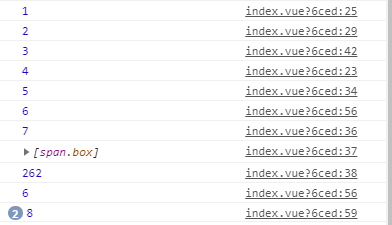
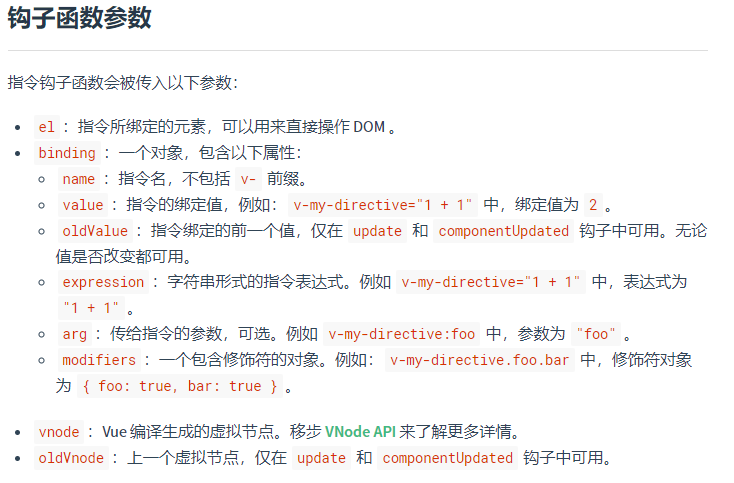

# VUE
<!-- [[toc]] -->

## 一、VUE-指令
- vue提供给HTML标签新增的属性

- 是带有v-前缀的特殊特性

    

### 1. v-text

```js

	-特点:
		--强制覆盖标签内所有的内容;
		--不能解析html;
	-语法:
    	<span v-text="msg"></span>
    	<!-- 和下面的一样 -->
    	<span>{{msg}}</span>
	
 --{{ }}
	-特点:
		--可三元表达式;
		--数值运算,字符串拼接;
		--数据可是arr,obj
```

### 2. v-html

```
强制覆盖里面的内容
```

### 3. v-bind

#### 3.0 - 基本使用

```js
简写: :
作用:将data里数据,绑定到htm标签的属性上

语法:
    
    <p v-bind:title='msg'>
        {{msg}}
    </p>

class操作:
	v-bind:class='参数' ;
	v-bind:class='true ? classA : '' '; //三元表达式,classA为data的参数;
	v-bind:class="[classA,classB]"; //数值传入多个 类名参数;
	v-bind:class="[classA,classObj]" //
	v-bind:class="classObj";	//对象通过value的true或false ;
		classObj:{
            classA:true,
            classB:false
        }

style操作:
	v-bind:style='{height="200px"}';
	v-bind:style='styleobj';
	v-bind:style='[styleobj1,styleobj2]'

<div v-bind="{ id: someProp, 'other-attr': otherProp }"></div> //批量绑定

```

#### 3.1 - class

##### 	3.1.1 	-	对象语法

- ```js
   v-bind:class="{ active: isActive, 'text-danger': hasError }"
   data: {
    isActive: true,
    error: null
  },
  ```

#####    3.1.2 	-	数组语法

- ```js
  <div v-bind:class="[activeClass, errorClass]"></div>
  data: {
    activeClass: 'active',
    errorClass: 'text-danger'
  }
  
  结果:<div class="active text-danger"></div>
  
  
  数组三元表达式:
  <div v-bind:class="[isActive ? activeClass : '', errorClass]"></div>
  
  计算属性类名:
  <div :class="Aclass"></div>
  computer:{
      Aclass(){
          return [
              'active',
              activeA:true,
          ]
      }
  }
  ```

#####   3.1.3 	-	组件类名叠加

- ```js
  组件类目叠加规则：
  Vue.component('my-component', {
    template: '<p class="foo bar">Hi</p>'
  })
  
  <my-component class="baz boo"></my-component>
  
  渲染结果:<p class="foo bar baz boo">Hi</p>
  
  标签类名叠加：
  <p class="foo" ：calss="bar">Hi</p>
  ```

####  3.2 - style

##### 	3.2.1 - 对象语法

- ```js
  <div v-bind:style="{ color: activeColor, fontSize: fontSize + 'px' }"></div>
  
  data: {
    activeColor: 'red',
    fontSize: 30
  }
  ```

##### 	3.2.2 - 数组语法

- ```js
  <div v-bind:style="[baseStyles, overridingStyles]"></div>
  
  baseStyles 为对象
  ```

##### 	3.2.3 - 多重值

- ```js
  <div :style="{ display: ['-webkit-box', '-ms-flexbox', 'flex'] }"></div>
  
  这样写只会渲染数组中最后一个被浏览器支持的值。在本例中，如果浏览器支持不带浏览器前缀的 flexbox，那么就只会渲染 display: flex。
  ```

### 	4. v-on

#### 	4.0 - 基本

- ```js
  简写:@
  作用:给元素绑定事件
  	
  	事件声明用:methods
      
  <div id="app" >
          <button v-on:click = 'fn'>点击</button>
  		<button @:click = 'fn'>点击2</button>
  </div>
  
  const app = new Vue({
      el:"#app",
      data:{
          msg:"库"
      },
      methods:{
          fn(){
             this.msg = '酷酷' //改变msg的属性值
          },
          fn2(){
              console.log(event) //vue的事件对象是event
          }
      }
  })
  ```

  

#### 	   4.1 - 事件修饰符

- ```js
  阻止事件默认行为
  	<button v-on:click.prevent = 'fn'>点击</button>
  
  .stop - 调用 event.stopPropagation()。
  .prevent - 调用 event.preventDefault()。
  .capture - 添加事件侦听器时使用 capture 模式。
  .self - 只当事件是从侦听器绑定的元素本身触发时才触发回调。
  .{keyCode | keyAlias} - 只当事件是从特定键触发时才触发回调。
  .native - 监听组件根元素的原生事件。
  .once - 只触发一次回调。
  .left - (2.2.0) 只当点击鼠标左键时触发。
  .right - (2.2.0) 只当点击鼠标右键时触发。
  .middle - (2.2.0) 只当点击鼠标中键时触发。
  .passive - (2.3.0) 以 { passive: true } 模式添加侦听器
  ```

#### 4.2 - 滑动事件

```js
@touchmove.prevent //移动端禁止局部滚动 

@scroll.prevent //PC端禁止局部滚动
```


#### 	this

```js
this指向vue的实例;

箭头函数:this指向的是window//参数指向的是window
```

### 5. v-model

```js
用于input textarea select ,动态绑定,双向绑定
用来获取用户输入的内容;


修饰符:
.lazy - 取代 input 监听 change 事件
.number - 输入字符串转为有效的数字
.trim - 输入首尾空格过滤
.sync 修饰符多个v-model
<my-dialog  :visible="dialogVisible"  @update:visible="newVisible => dialogVisible = newVisible"/>
   

```

### 自定义v-model

```js
<template>
  <div class="w-popup">
    <div class="w-shade">ss</div>
  </div>
</template>

<script>
export default {
  model: {
    prop: 'show', //注意 是字符串
    event: 'mEventChange'
  },
  props: {
    show: Boolean
  },
  data() {
    return {};
  },
  watch: {
    show(val) {
      this.$emit('watch mEventChange', val); 
        //会把值传给v-model
    }
  }
};
</script>
```


### 6. v-for

作用：用于渲染列表；必须带key

```js
<template v-for="item in list">
	<div :key="item.id"></div>
</template>
```


#### 	6.1 - 数组渲染

- ```js
  <p v-for="(item,index) in arr"></p>
  <p v-for="item in arr"></p>
  
  ```

####    6.2 - 对象渲染

- ```js
  <div v-for="(value, key, index) in object">
  ```

####    6.3 - 计算属性 方法

- ```js
  用于过滤数据后渲染
  
  <li v-for="n in evenNumbers">{{ n }}</li>
  <li v-for="n in even(numbers)">{{ n }}</li>
  
  data: {
    numbers: [ 1, 2, 3, 4, 5 ]
  },
  computed: {
    evenNumbers: function () {
      return this.numbers.filter(function (number) {
        return number % 2 === 0
      })
    }，
    even: function (numbers) {
      return numbers.filter(function (number) {
        return number % 2 === 0
      })
    }
  }
  ```

####    6.4 - 使用template

- ```js
  用template 包裹多个标签，template不会被渲染到页面，避免多余标签。
  <template v-if='true'>
  	<p>1</p>
  	<p>1</p>
  	.......
  </template>
  ----------------
  
  应用：渲染不同的 li标签
  <ul>
    <template v-for="item in items">
      <li>{{ item.msg }}</li>
      <li class="divider"></li>
    </template>
  </ul>
  ```

  

####   6.5 - 渲染组件

- ```js
  有些 HTML 元素，<ul>、<ol>、<table> 和 <select>，
  内部只能放特定标签<li>,<tr> <option>等；
  
  <blog-post-row /> 为组件
  
  <ul>
    <blog-post-row></blog-post-row>
  </ul>
  <blog-post-row> 会被作为无效的内容提升到外部，并导致最终渲染结果出错。
  
  <ul>
    <tr is="blog-post-row"></tr>
  </ul>
  
  需要注意的是如果我们从以下来源使用模板的话，这条限制是不存在的：
  
  字符串 (例如：template: '...')
  单文件组件 (.vue)
  <script type="text/x-template">
  ```

  

#### 6.6 - v-for中获取不到DOM解决

##### 	6.6.1 - this.$nextTick

- ```js
  1.
  mounted（）{
      this.$nextTick(() => {
        //获取DOM
   	});
  }，
  
  2.当-for中渲染数据为异步请求时；1中方法可能获取不到；需要把this.$nextTick放在获取数据之后；
  
  mounted(){
  	this.$axios.get('/data').then((res=>{
          //data 为渲染for的数据
          this.data = res.data
          this.$nextTick(() => {
        		//获取DOM
   		});
      }))
  }
  
  ```

##### 	6.6.2 - 放入updated中获取

- ```
  每次跟新视图，都会触发该操作。
  ```

#####     6.6.3 - 放入setTimeout中获取

- ```js
  mounted(){
      setTimeout(() => {
  		//获取DOM
      }, timeout);
  }
  ```

#### 6.7 - v-for强制渲染

- ```js
  层级过深可能影响渲染：用如下强制渲染
  this.$forceUpdate()
  ```

  

### 	v-if

```js
v-if
v-else-if
v-else

v-else 元素必须立即跟在 v-if 或 v-show 元素的后面——否则它不能被识别。
```

### 	v-show

```js
v-show='isshow=false'
v-show='isshow'
data:{
    isshow:true
}
通过控制data的isshow,来控制v-show
```

### v-cloak

```js
防止暴露{{val}}语法
<style>
	[v-cloak]{
        display:none;
    }
</style>
<div id='app' v-cloak>
</div>
```

### v-once

```js
只被渲染一次
<p v-once>{{msg}}</p> 
```

### v-pre

```js
不解析
<p v-pre>{{msg}}</p> // {{msg}}
```


## 插槽slot

```js
父用子组件时标签内的内容不会被渲染;所以在子组件加入<slot></slot>插槽,接收父调用子组件标签内的内容.

父:
<son> 
	<div>1</div>
	<div>2</div>
</son>
子:
<div>
	<slot></slot> // 1 2
	<slot></slot> // 1 2
</div>


```

#### 具名插槽:

```js
2.6后弃用
父:
<son> 
	<div slot="a">1</div>
	<div slot="b">2</div>
</son>

子:
<div>
	<slot name="a"></slot> // 1 
	<slot  name="b"></slot> // 2
</div>

新语法: v-slot: 只能用在组件上或用<template>包起来
	-父:
        <son> 
            <template v-slot:a> //a不需要用""
                <div>1</div>
            </template>

            <template v-slot:b>
                <div>2</div>
            </template>
        </son>

	-子:
        <div>
            <slot name="a"></slot> // 1 
            <slot  name="b"></slot> // 2
        </div>
```

#### 作用域插槽

```js
子:
<slot  name="slotName" :b="sondata"> </slot>
data(){
	return{
        sondata:'啦啦'
    }
}
```

```js
解决子组件数据向父传递

新语法:
父:
`1.正常写法:`
<template v-slot:slotName="c" > //指定插槽并接收数据 slotName为插件槽名,默认:difault
    <div>{{c.b}}</div> //啦啦
</template>
```

```js
`2.解构写法:`
<template v-slot:slotName="{b}" > 
    <div>{{b}}</div> //啦啦
</template>
```

```js
动态插槽名
<template v-slot:[slotName]="{b}" > 
    <div>{{b}}</div> //啦啦
</template>
```

#### this.$slots

```js
子组件中判断是否有用某个slots
mounted() {
    this.desc = this.$slots.slotName !== undefined;
  }

默认为slotName为 default
```


## 二、VUE-方法

### filters-过滤器

```js
html中使用：

<p> {{val | fn(a) }} </p>
<div :id="message | fn(a)"></div>


1.filter的第一个参数为html中的值；
2.需要return 新值
3.可传参；
filters:{
	fn(val,a){
		return ~~(val/60)+'分'+(val%60)+'a'; //使用val不使用this
	}
}


1.过滤器可传参数;

2.链式调用
{{val | fn | fn2```}}//顺序左到右


3.全局过滤器
 单个
Vue.filter('formaTime',(val)=>{
	return 
})

	多个：
import * as filters from './filters'

Object.keys(filters).forEach(key => {
  Vue.filter(key, filters[key])
})
```

filters中获取this的方法

- ```js
  var that = this
  export default {
  	beforeCreate () {
      	that = this
  	},
  	filters:{
  		fn(val){
  			
  			return x
  		}
  	}
  }
  ```


### computed-计算属性

```js
用法：
1.在computed属性对象中定义计算属性的方法，在页面中使用{{方法名}}来显示计算的结果。

2.通过getter\setter实现对属性数据的显示和监视，计算属性存在缓存，多次读取只执行一次getter计算。
	只有当计算属性重新赋值时才执行set；

computed:{
	fn(){
		return ~~(this.num/60)+'分'+(this.num%60)
	}
},

<p> {{fn }} </p>

写法二/
computed：{
    fn：{ //对象写法
        get（）{
        
        },
        set(){
            
        }
    }
}
写法三:传入参数
computed:{
    Compute_data(){
        return (params)=>{
            return params+2
        }
    }
}

案例设置全选:
<span @click="isAll = !isAll"></span>
isAll: {
      get () {
        // 所有商品都勾选，为true
        return this.goodsList.every(v => {
          return v.checked
        })
      },
      set (newValue) { //点击时改变isAll则会触发set()
        console.log(newValue)
        this.goodsList.forEach(v => {
          v.checked = newValue
        })
      }
    }
```

### watch-侦听器

```js
data: {
    myNumber: 'Dawei',
        obj: {
        a: ''
    }
  },
watch:{
   	/*第一种写法: 方法写法*/
	myNumber(new,old){
		
	}
    
    /*第二种写法: 字符串方法名*/
    myNumber:'方法名'
    
    /*第三种写法: 对象*/
    myNumber:{
        handler(new,old){
            
        }
        immediate: true //true为立即执行,首次绑定是否执行
    }
    
     /*第四种写法: 字符串对象*/
    'obj.name':{ //直接找到要侦听对象,减少性能损耗
        handler(new,old){
            
        },
        deep:true //深度监听 复杂类型侦听
        immediate: true //true为立即执行,首次绑定是否执行
    },
    
}

判断:
watch:{
	"$route.params.keywords"(new,old){ //注意加""   
		
	}
   //检测$route.params的变化
}
```

方法:

```js
handler(new,old){};//要执行的方法
immediate:true;//首次绑定是否执行
deep:true//深侦听
```


#### 注销侦听

```js
1.组件内的侦听器会随着组件销毁而销毁;
2.组件外的侦听器需要运用unWatch方法注销;防止内存溢出;

侦听中的handler()如用箭头函数,则this无法获取vue的实例;
```


## 三、生命周期

  


```js
beforeCreate 	组件实例刚被创建，组件属性计算之前，如data属性等
created 	组件实例创建完成，属性已绑定，但DOM还未生成，$el属性还不存在

beforeMount 	模板编译 / 挂载之前
mounted 	    模板编译 / 挂载之后

beforeUpdate 	组件更新之前
update 	        组件更新之后

beforeDestory 	组件销毁前调用
destoryed 	    组件销毁后调用

activated 	    组件被激活时调用(能看到的)
deactivated 	组件被移除时调用(离开,看不到的)
```


### updated

```js
生命周期是一个方法,
    与el,data平级;
页面渲染后执行
updated(){
    
}
会监听所有数据,导致性能浪费

解决优化:
	
this.$nextTick(()=>{
    //等页面更新渲染完成后,再执行
})


```

### mounted

```js
生命周期:
vue把内部的data和页面内容初始化完毕并渲染挂载到页面上之后,自动执行mounted
mounted(){
    
}
```

### created

```
vue创建后
```


### 获取dom元素,ref

```js
<p ref='p'> </p>

mounted(){
	this.$refs.p
}
------------
mounted() {
	myScroll = new IScroll(this.$refs.box, {
		moserWheel: true,
		scrollbars: true
	})
},
undate(){
	this.myScroll.refresh()
}
```

### nextTick

原理：

```
基于异步：promise，MutationObserver，setImmediate，setTimeout
```


```js
async created() {
    localStorage.setItem("login", "login");
    setTimeout(() => {
      console.log(4);
    }, 1000);
    console.log(1);
  },
mounted() {
    console.log(2);
    setTimeout(() => {
      this.data = 2000;
      console.log(5);
      this.$nextTick(() => {
        console.log(7);
        console.log(this.$refs.divbox1);
        console.log(document.getElementsByClassName("box")[12].offsetLeft);
      });
    }, 1000);
    this.$nextTick(()=>{
          console.log(3);
          
    })
  },
updated() {
    console.log(6);
    this.data=20
    this.$nextTick(() => {
      console.log(8);
    });
  }
```



## 自定义指令-directives

```js
局部指令:
    directives:{
     hm:{
         inserted(ele){
             el.focus();//
         }
     }
    }
<input type='text' v-hm> //ele为input元素,执行focus();

全局指令:
    Vue.directive('focus',{
    	inserted:function(el){
        	el.focus()
    	}
	})
```

### 钩子函数

```js
bind：只调用一次，指令第一次绑定到元素时调用。在这里可以进行一次性的初始化设置。

inserted：被绑定元素插入父节点时调用 (仅保证父节点存在，但不一定已被插入文档中)。

update：所在组件的 VNode 更新时调用，但是可能发生在其子 VNode 更新之前。指令的值可能发生了改变，也可能没有。但是你可以通过比较更新前后的值来忽略不必要的模板更新 (详细的钩子函数参数见下)。
```



```js
异常处理            
try{
	return  //试着执行这句,是否有异常,异常则执行catch
}catch{
    return
}
0123 4444
```


## vue-ES6

### ES6导入导出

```js
所有方式的导入,都会执行被导入文件.
一个文件默认只能暴露一个
-导入方式:
`1-默认`:
    默认暴露(导出):
    export default name
    export default {对象}
        默认导入:
    import name from '路径'

2-按名字暴露:
	export const name="jack"
    export const age="18"
    
    导入:
	import { name } from '路径'
	import {name,age} from '路径'
```

例子

```js
文件:one.js
export const name = 'jack'
export default 'abc'

import name from "./one.js" // abc
import {name} from "./one.js" // jack
```

### async await

```js
// async 是用来修饰函数（方法）的
// 代表这个函数里面要做异步操作：读取文件、发请求
// 结论1：如果仅仅只有async跟不加也没区别
// 结论2：await不能单独使用，必须配合async使用，如果你写await所在的函数没用async修饰，会报错
// 结论3：用await修饰的代码，它所在的函数里的后面的代码暂时不执行，要等await修饰的异步操作结束才执行，
//        但是不影响await函数外的代码
// 可以这么说：如果执行了await，相当于可以理解为这个函数就执行完了
// 这么记：await跟return有点像，都会让函数先结束，区别在于return后面的绝对不执行，而await会等异步操作完了后执行


async function readSome(){

    console.log('111111'); //1
    
    await fs.readFile('./files/a.txt',(error,data) => {

        console.log(data.toString());
        
    });

    await fs.readFile('./files/b.txt',(error,data) => {

        console.log(data.toString());
        
    })

    await fs.readFile('./files/c.txt',(error,data) => {

        console.log(data.toString());
        
    })
    
}
readSome()
console.log('我在函数外面');//2

----------

优化axios请求:

1.axios.get方法返回值是promise对象;
2..then,代表promise里面resolve赋值

await 特点:
	1.要等它异步执行完再执行它后面的代码
    2.它的返回值是promise对象的resolve的参数
async created(){
    //加await res返回值是backdata(响应体) 特点2
    let res = await this.$axios.get('url')
	this.form = res.data.data
    
	let res2 = await this.$axios.get("url")
    this.form2 = res2.data.data
}    

```


## 动画

### 过渡的类名

```css
.fade-leave-active,
.fade-enter-active {
  		transition: all .3s ease;
	}

.fade-enter,
.fade-leave-to{
  	transform: translateX(10px);
  	opacity: 0;
  }

 <transition name="fade">
    <p v-if="show">hello</p>
  </transition>
```

------

### css动画

```css
.bounce-enter-active {
  animation: bounce-in .5s;
}
.bounce-leave-active {
  animation: bounce-in .5s reverse;
}
@keyframes bounce-in {
  0% {
    transform: scale(0);
  }
  50% {
    transform: scale(1.5);
  }
  100% {
    transform: scale(1);
  }
}

<transition name="bounce">
    <p v-if="show">Lorem</p>
</transition>
```

### 过渡动画

```js
<transtion name='fade'> </transtion>


transition-delay': index*100+'ms'


  .bounceInDown-enter-active,
    .bounceInDown-leave-active {
      animation: bounceInDown 1s;
    } 
 

    .bounceInDown-enter,
    .bounceInDown-leave-to { 
      opacity: 0;
      transform: translateY(30px);
     }
     .bounceInDown-enter-to,
     .bounceInDown-leave{
      opacity: 0;
     }

<transition-group class="weather_list" name="bounceInDown" tag="ul">
    <li :key='index'>
```

## audio

```js
https://developer.mozilla.org/zh-CN/docs/Web/Guide/Events/Media_events

```

------


## 插件

### iScroll插件

```js
http://caibaojian.com/iscroll-5/

const wraper = document.queryseletcor('.wraper')
const myScroll = new Iscroll(wraper,{
   scrollbars:true,//显示滚动条（默认是false不显示）
   mouseWheel:true,//支持鼠标触发区域滚动
   bounce:true,//取消达到边界的缓冲效果
})

this.myScroll.refresh()
刷新
```

```js
mouseWheel: true,//允许鼠标滚动
scrollbars:true//显示滚动条
bounce:true//反弹动画
click:true//允许容器内元素能绑定点击事件
disableMouse: true,//禁用鼠标
scrollX:true,//横向可以用
scrollY:true,//纵向可以使用
startX:0//X方向滚动的起始位置
startY:0//X方向滚动的起始位置
```

```js
https://blog.csdn.net/justlpf/article/details/82783147
myScroll.destroy();//销毁iscroll
myScroll = null;//清空引用
```

### NProgress插件

```js
npm i --save nprogress

import NProgress from 'nprogress'
import 'nprogress/nprogress.css'

NProgress.start() 开启一个进度条
nprogress.done() 关闭一个进度条
```

### 富文本插件

```js
https://github.com/surmon-china/vue-quill-editor
npm install vue-quill-editor --save

// require styles
import 'quill/dist/quill.core.css '
import 'quill/dist/quill.snow.css'
import 'quill/dist/quill.bubble.css'

import { quillEditor } from 'vue-quill-editor'

注册成组件
export default {
  components: {
    quillEditor
  }
}

<channelModel></channelModel>
```

### DayJs

```js

```

### moment-Js

```js
npm install moment --save  

import moment from 'moment'

//全局过滤属性
Vue.filter('dateFormat', function (daraStr, pattern = 'YYYY-MM-DD HH:mm:ss') {
  return moment(daraStr).format(pattern)
})

计算属性中使用:
com_date:function(){
     return moment(new Date()).add(7,'days').format('YYYY-MM-DD')
    }
```

| Input      | Example          | Description                                            |
| :--------- | :--------------- | :----------------------------------------------------- |
| `YYYY`     | `2014`           | 4 or 2 digit year                                      |
| `YY`       | `14`             | 2 digit year                                           |
| `Y`        | `-25`            | Year with any number of digits and sign                |
| `Q`        | `1..4`           | Quarter of year. Sets month to first month in quarter. |
| `M MM`     | `1..12`          | Month number                                           |
| `MMM MMMM` | `Jan..December`  | Month name in locale set by `moment.locale()`          |
| `D DD`     | `1..31`          | Day of month                                           |
| `Do`       | `1st..31st`      | 每月中的第几天                                         |
| `DDD DDDD` | `1..365`         | 一年中的第几天                                         |
| `X`        | `1410715640.579` | Unix timestamp                                         |
| `x`        | `1410715640579`  | Unix ms timestamp                                      |

### bigint

```js
安装:npm i json-bigint

import JSONbig from 'json-bigint'


```

### 移动端自适应

```js
npm install lib-flexible --save-dev

安装:webpack loader:px2rem-loader
npm install px2rem-loader --save-dev

----------
 npm install postcss-pxtorem --save-dev
npm i -S amfe-flexible

mani.js
引入import 'amfe-flexible'

postcss.config.js
module.exports = {
  plugins: {
    'autoprefixer': {
      browsers: ['Android >= 4.0', 'iOS >= 7']
    },
    'postcss-pxtorem': {
      rootValue: 37.5,
      propList: ['*']
    }
  }
}
```

### stylus安装

```js
npm install stylus stylus-loader --save-dev

vue.app
<style scoped lang="stylus" rel="stylesheet/stylus">

</style>

mani.js
import './common/stylus/index.styl'

或style
 @import "assets/base.styl";
```

### vue.ls

```
npm install vue-ls --save
```

```js
import Storage from 'vue-ls';
 
options = {
  namespace: 'vuejs__', // key键前缀
  name: 'ls', // 命名Vue变量.[ls]或this.[$ls],
  storage: 'local', // 存储名称: session, local, memory
};
 
Vue.use(Storage, options);
// 或 Vue.use(Storage);
 
new Vue({
    el: '#app',
    mounted: function() {
        Vue.ls.set('foo', 'boo');
        // 设置有效期
        Vue.ls.set('foo', 'boo', 60 * 60 * 1000); //有效1小时
        Vue.ls.get('foo');
        Vue.ls.get('boo', 10); // 无boo则设置boo默认值为10 
        
        let callback = (val, oldVal, url) => {
          console.log('localStorage change', val);
        } 
        
        Vue.ls.on('foo', callback) //监听改变foo键并触发回调 
        Vue.ls.off('foo', callback) //删除监听
        
        Vue.ls.remove('foo'); // 移除
        Vue.ls.clear();	//清除
    }
});
```

```js
Global:Vue.ls
Context:this.$ls
```

### 获取图片主题色

```js
olorthief.js
 var colorThief = new ColorThief();
var img = new Image();
img.addEventListener('load', function() {
var colorlist = colorThief.getColor(img);
document.getElementById('bannerwrap').style.backgroundColor = `rgba(${colorlist[0]},${colorlist[1]},${colorlist[2]},1)`;
            });
img.crossOrigin = 'Anonymous';
img.src = newsrc;
```


## vue渲染render()

https://www.jianshu.com/p/7508d2a114d3

### 	一、vue渲染方式

- **独立构建**：包含模板编译器，渲染过程`HTML字符串 → render函数 → VNode → 真实DOM节点`
- **运行时构建**：不包含模板编译器，渲染过程`render函数 → VNode → 真实DOM节点`

运行时构建的包，会比独立构建少一个模板编译器。在`$mount`函数上也不同。而`$mount`方法又是整个渲染过程的起始点。用一张流程图来说明：


#### 1.	自定义`render函数`

##### 	非单页写法：

```js
Vue.component('anchored-heading', {
    render: function (createElement) {
        return createElement (
            'h' + this.level,   // tag name标签名称
            this.$slots.default // 子组件中的阵列
        )
    },
    props: {
        level: {
            type: Number,
            required: true
        }
    }
})
```

##### 	vue-cli写法：

```vue
.vue文件
去掉<template>即可


<script>
export default {
  methods: {
    btn() {
      console.log("bbb");
    }
  },
  render(h) {
    return h(
      "div",
      {
        class: "menb",
        attrs: {
          id: "boo",
          data: "789"
        },
        // domProps: {
        //   innerText: "啦啦啦"
        // }
        on: {
          click: this.btn
        }
      },
      [h("p", "hellso"), h("p", "lalla")]
    );
  }
};
</script>

<style>
</style>
```

```js
导入：
<template>
	<menA />    
</template>

import menA from './menB'
export default {
	components:{
	menA
	}
}
```

##### 	jsx写法：

```jsx
export default {
    data(){
        return {
            title:'我们'
        }
    },
    render(){
        return <div>
            jsxjsx,{this.title}
        </div>
    }
}
```


#### 2.	 `template`写法

```js
let app = new Vue({
    template: `<div>{{ msg }}</div>`,
    data () {
        return {
            msg: ''
        }
    }
})
```

#### 3.	`el`写法

```js
let app = new Vue({
    el: '#app',
    data () {
        return {
            msg: 'Hello Vue!'
        }
    }
})
```

### 二、Vue.createElement

#### 1.	参数:

- #### param-1: `{String | Object | Function}` 元素

```js
#String 
<div id="app">
    <custom-element></custom-element>
</div>

Vue.component('custom-element', {
    render: function (createElement) {
        return createElement('div')
    }
})

let app = new Vue({
    el: '#app'
})
```


```js
#Object 
Vue.component('custom-element', {
    render: function (createElement) {
        return createElement({
            template: `<div>Hello Vue!</div>`
        })
    }
})
```

```js
#Function
Vue.component('custom-element', {
    render: function (createElement) {
        var eleFun = function () {
            return {
                template: `<div>Hello Vue!</div>`
            }
        }
        return createElement(eleFun())
    }
})
```


- param-2: `{Object}`  元素属性

```js
<div id="app">
    <custom-element></custom-element>
</div>

Vue.component('custom-element', {
    render: function (createElement) {
        var self = this

        // 第一个参数是一个简单的HTML标签字符 “必选”
        // 第二个参数是一个包含模板相关属性的数据对象 “可选”
        return createElement('div', {
            'class': {
                foo: true,
                bar: false
            },
            style: {
                color: 'red',
                fontSize: '14px'
            },
            attrs: {
                id: 'boo'
            },
            domProps: {
                innerHTML: 'Hello Vue!'
            }
        })
    }
})

let app = new Vue({
    el: '#app'
})
```

- param-3: `{String | Array}` 可选 子元素

```js
<div id="app">
    <custom-element></custom-element>
</div>

Vue.component('custom-element', {
    render: function (createElement) {
        var self = this

        return createElement(
            'div', // 第一个参数是一个简单的HTML标签字符 “必选”
            {
                class: {
                    title: true
                },
                style: {
                    border: '1px solid',
                    padding: '10px'
                }
            }, // 第二个参数是一个包含模板相关属性的数据对象 “可选”
            [
                createElement('h1', 'Hello Vue!'),
                createElement('p', '开始学习Vue!')
            ] // 第三个参数是传了多个子元素的一个数组 “可选”
        )
    }
})

let app = new Vue({
    el: '#app'
})
```

#### 2.属性

```js
{
  // 和`v-bind:class`一样的 API
  // 接收一个字符串、对象或字符串和对象组成的数组
  'class': {
    foo: true,
    bar: false
  },
  // 和`v-bind:style`一样的 API
  // 接收一个字符串、对象或对象组成的数组
  style: {
    color: 'red',
    fontSize: '14px'
  },
  // 正常的 HTML 特性
  attrs: {
    id: 'foo'
  },
  // 组件 props
  props: {
    myProp: 'bar'
  },
  // DOM 属性
  domProps: {
    innerHTML: 'baz'
  },
  // 事件监听器基于 `on`
  // 所以不再支持如 `v-on:keyup.enter` 修饰器
  // 需要手动匹配 keyCode。
  on: {
    click: this.clickHandler
  },
  // 仅对于组件，用于监听原生事件，而不是组件内部使用
  // `vm.$emit` 触发的事件。
  nativeOn: {
    click: this.nativeClickHandler
  },
  // 自定义指令。注意，你无法对 `binding` 中的 `oldValue`
  // 赋值，因为 Vue 已经自动为你进行了同步。
  directives: [
    {
      name: 'my-custom-directive',
      value: '2',
      expression: '1 + 1',
      arg: 'foo',
      modifiers: {
        bar: true
      }
    }
  ],
  // 作用域插槽格式
  // { name: props => VNode | Array<VNode> }
  scopedSlots: {
    default: props => createElement('span', props.text)
  },
  // 如果组件是其他组件的子组件，需为插槽指定名称
  slot: 'name-of-slot',
  // 其他特殊顶层属性
  key: 'myKey',
  ref: 'myRef'
}
```


### 三、挂载方式

```js
var MyComponent = Vue.extend({
  template: '<div>Hello!</div>'
})

// 创建并挂载到 #app (会替换 #app)
new MyComponent().$mount('#app')

// 同上
new MyComponent({ el: '#app' })

// 或者，在文档之外渲染并且随后挂载
var component = new MyComponent().$mount()
document.getElementById('app').appendChild(component.$el)

```

## Vue-extend()

​	Vue.extend({ })

```js
import Vue from 'vue'

const testComponent = Vue.extend({
  template: '<div>{{ text }}</div>',
  data: function () {
    return {
      text: 'extend test'
    }
  }
})

1.
//手动渲染
const extendComponent = new testComponent().$mount()
//可以通过 $el 属性来访问 extendComponent 组件实例
document.body.appendChild(extendComponent.$el)

2.渲染并挂载
new testComponent().$mount('#boxId')

3.作为组件挂载到#box
let todowarp = new testComponent()
Vue.component('todo', todoWarp)
var vm = new Vue({
         el: "#box"
     });

4.vue-cli
let Todowarp = new testComponent()
extend defalut {
	components:{
    	Todowarp
    }
}
```

new.extend({})合并规则

```js
var myVue = Vue.extend({
// 预设选项
})

var vm = new myVue({
// 其他选项
})

实例化extends组件构造器时传入的属性必须是propsDate,而不是props
new testComponent({
	propData:{
        text:'dd'
    }
})

new myVue({})后会合并预设选项和其他选项中的所有属性选项：

1.data数据对象在内部会进行浅合并 (一层属性深度)。

2.钩子函数会先执行预设选项中的

3.值为对象的选项，例如 methods, components 将被混合为同一个对象，两个对象键名冲突时，会以new myVue({})对象的选项为准。

注意：混入 (mixins) 也使用同样的策略进行合并。
```

应用:

>```js
>.vue
>
><template>
><transition name="fade">
>    <div class="message" :class="type" v-show="show">
>      <i class="icon"></i>
>      <span class="text">{{text}}</span>
>    </div>
></transition>
></template>
>
><script type="text/ecmascript-6">
>  export default {
>    name: 'message',
>    props: {
>      type: {
>        type: String,
>        default: 'info',
>        validator: val => ['info', 'success', 'warning', 'error'].includes(val)
>//['info', 'success', 'warning', 'error'] 表示type只接收这四个字符串作为参数传入message组件
>      },
>      text: {
>        type: String,
>        default: ''
>      },
>      show: {
>        type: Boolean,
>        default: false
>      }
>    }
>  }
></script>
>```
>
>
>
>```js
>index.js
>import Message from './Message.vue'
>
>const MESSAGE = {
>  duration: 3000, // 显示的时间 ms
>  animateTime: 300, // 动画时间,表示这个组件切换show的动画时间
>  install(Vue) {
>    if (typeof window !== 'undefined' && window.Vue) {
>      Vue = window.Vue
>    }
>    Vue.component('Message', Message)
>
>    function msg(type, text, callBack) {
>      let msg
>      let duration = MESSAGE.duration
>      if (typeof text === 'string') {
>        msg = text
>      } else if (text instanceof Object) {
>        msg = text.text || ''
>        if (text.duration) {
>          duration = text.duration
>        }
>      }
>      let VueMessage = Vue.extend({
>        render(h) {
>          let props = {
>            type,
>            text: msg,
>            show: this.show
>          }
>          return h('message', {props})
>        },
>        data() {
>          return {
>            show: false
>          }
>        }
>      })
>      let newMessage = new VueMessage()
>      let vm = newMessage.$mount()
>      let el = vm.$el
>      document.body.appendChild(el) // 把生成的提示的dom插入body中
>      vm.show = true
>      let t1 = setTimeout(() => {
>        clearTimeout(t1)
>        vm.show = false  //隐藏提示组件，此时会有300ms的动画效果，等动画效果过了再从body中移除dom
>        let t2 = setTimeout(() => {
>          clearTimeout(t2)
>          document.body.removeChild(el) //从body中移除dom
>          newMessage.$destroy()
>          vm = null // 设置为null，好让js垃圾回收算法回收，释放内存
>
>          callBack && (typeof callBack === 'function') && callBack() 
>      // 如果有回调函数就执行，没有就不执行，用&&操作符，
>      // 只有&&左边 的代码为true才执行&&右边的代码，避免用面条代码：
>      // if(true){
>      //   ... 
>      //   if(true){
>      //   ...
>      //   }
>      // }
>        }, MESSAGE.animateTime)
>      }, duration)
>    }
>
>// 挂载到vue原型上，暴露四个方法
>    Vue.prototype.$message = {
>      info(text, callBack) {
>        if (!text) return
>        msg('info', text, callBack)
>      },
>      success(text, callBack) {
>        if (!text) return
>        msg('success', text, callBack)
>      },
>      error(text, callBack) {
>        if (!text) return
>        msg('error', text, callBack)
>      },
>      warning(text, callBack) {
>        if (!text) return
>        msg('warning', text, callBack)
>      }
>    }
>  }
>}
>export default MESSAGE
>```
>
>```js
>import Vue from 'vue'
>import vMessage from './components/Message/index' 
>Vue.use(vMessage)
>```
>
>

## vue.component

vue.component用于全局注册组件

```js
// 注册组件，传入一个扩展过的构造器
Vue.component('my-component', Vue.extend({ /* ... */ }))

// 注册组件，传入一个选项对象 (自动调用 Vue.extend)
Vue.component('my-component', { /* ... */ })

// 获取注册的组件 (始终返回构造器)
var MyComponent = Vue.component('my-component')
```


## mixin

 来分发 Vue 组件中的可复用功能 

```js
// 定义一个混入对象
var myMixin = {
  created: function () {
    this.hello()
  },
  methods: {
    hello: function () {
      console.log('hello from mixin!')
    }
  }
}

// 定义一个使用混入对象的组件
var Component = Vue.extend({
  mixins: [myMixin]
})

var component = new Component() // => "hello from mixin!"
```

### 1.基础用法

```js
let mixin = {
  data() {
    return {
      msg: 'hello mixin'
    }
  },
  created() {
    console.log('混入的钩子函数');
  },
  methods: {
    show() {
      console.log(this.msg);
    }
  }
}
export default mixin;
```

```js
index.vue

<template>
  <div id="myVue">
    <span @click="show">{{msg}}</span>
  </div>
</template>
<script>
  import myMixin from './mixin.js';
  export default {
    name: 'myVue',
    mixins: [myMixin],
    created() {
      console.log('组件自身的钩子函数');
    }
  }
</script>
```

### 2.main.js中直接全局注册

```js
import Vue from 'vue';
import App from './App';

Vue.mixin({
  created() {
    console.log('全局混入的钩子函数');
  }
});

/* eslint-disable no-new */
new Vue({
  el: '#app',
  components: { App },
  template: '<App/>'
});
```

### 3.模块化注册

```js
export default {
  install(Vue) {
    Vue.mixin({
      created() {
        console.log('全局混入的钩子函数');
      }
    })
  }
}
```

```js
main.js
import Vue from 'vue';
import App from './App';
import myMixin from './mixin.js';

Vue.use(myMixin);

/* eslint-disable no-new */ 
new Vue({
  el: '#app',
  components: { App },
  template: '<App/>'
});
```

## $attrs 和 $listeners

```js
$attrs 所有组件标签中的行内属性,除class和style

组件内调用:this.$attrs;
如何组件内某个标签用:
父:<son :data="data"></son>
子:
<div>  //根标签也会继承
	<input v-bind:$attrs>    
</div>
取消根标签继承:禁用特性继承
export default {
    inheritAttrs:false
}
```

```js
$listeners

子接收:<input v-on="$listeners"> 
    //接收所有父组件写在子组件的事件
```

## $options

```js
this.$options 获取data外得值

export default {
	name:'拉拉',
    data(){
        return{
            
        }
    },
    methods:{
        btn(){
            this.$options.name // 拉拉
        }
    }
}
```


## SPA单页面

```js
预留:什么是SSR服务端渲染
```

```js
https://router.vuejs.org/zh/installation.html
```

```js
vue Router
```

```html
<!DOCTYPE html>
<html lang="en">

<head>
    <meta charset="UTF-8">
    <meta name="viewport" content="width=device-width, initial-scale=1.0">
    <meta http-equiv="X-UA-Compatible" content="ie=edge">
    <title>Document</title>
</head>

<body>
    <div id="app">
        <p>
            <!-- 使用 router-link 组件来导航. -->
            <!-- 通过传入 `to` 属性指定链接. -->
            <!-- <router-link> 默认会被渲染成一个 `<a>` 标签 -->
            <router-link to="/haha">哈哈</router-link>
            <router-link to="/hehe">呵呵</router-link>
            <router-link to="/xixi">嘻嘻</router-link>
            <router-link to="/lala">啦啦</router-link>
        </p>
        <!-- 路由出口 -->
        <!-- 路由匹配到的组件将渲染在这里 -->
        <router-view></router-view>
    </div>
</body>

</html>
<script src="./lib/vue.js"></script>
<script src="./lib/vue-router.js"></script>
<script>
    // 定义 (路由) 组件
    const MyBox1 = {
        data() {
            return {
                msg: "学好vue"
            }
        },
        template: "<div><p>{{msg}}</p></div>"
    }
    const MyBox2 = {
        template: "<div></div>"
    }
    const MyBox3 = {
        template: "<div></div>"
    }
    const MyBox4 = {
        template: "<div></div>"
    }

    // 2. 定义路由
    // 每个路由应该映射一个组件
    const routes = [{
        path: '/haha',
        component: MyBox1
    }, {
        path: '/hehe',
        component: MyBox2
    }, {
        path: '/xixi',
        component: MyBox3
    }, {
        path: '/lala',
        component: MyBox4
    }]

    // 3. 创建 router 实例，然后传 `routes` 配置
    const router = new VueRouter({
       // routes // (缩写) 相当于 routes: routes
        routes:[{
        path: '/haha',
        component: MyBox1
    }, {
        path: '/hehe',
        component: MyBox2
    }, {
        path: '/xixi',
        component: MyBox3
    }, {
        path: '/lala',
        component: MyBox4
    },{
        path:'/long',
        redirect:'/long' // 重定向默认地址
    }],
        linkActiveClass
    })
	
   

    // 4. 创建和挂载根实例。
    // 记得要通过 router 配置参数注入路由，
    // 从而让整个应用都有路由功能
    const app = new Vue({
        el: "#app",
        router
    })
</script>
```

### 编程式导航

```
声明式导航
<a href="/run">aa</a>
<router-link to="/run">aa</router-link>
编程式导航
window.location.href = "地址"
router.push('地址')
```


```js
router.push({ 
    path: 'register', //路径地址
    query: { 
        plan: 'private' //路径参数
    }
})
//输出 /register?plan=private


// 字符串
router.push('home')

// 对象
router.push({ path: 'home' })

// 命名的路由
router.push({ name: 'user', params: { userId: '123' }})

// 带查询参数，变成 /register?key=value
router.push({ path: 'register', query: { key: 'value' }})


this.$router.params.key

 const routes = [{
    path: '/results/:key',
    component: results
  }
```

### 实现原理

>1.History API
>
>```js
>pushState //添加历史
>onpopstate 事件	//响应
>```
>
>2.hash
>
>```js
>location.hash //
>hashchange //监听地址变化
>```
>
>


## VUE-Component 组件

组件化与模块化的不同：

　　　模块化：是从代码逻辑的角度进行分析，方便代码分层开发，保证每个功能模块的只能单一　　

　　　组件化：是从UI界面的角度进行划分，前端的组件化，方便UI组件的重用。

```js
<script type='html/text' id="tempid">  //type="text/x-component"
    <div>
        //和正常vue操作
    {{mymsg}} //kuku
    {{msg}} //bbb
    {{mymsg2}} //aaa
    
    </div>	//只能一个父标签,不能有父元素同级
</script>

Vue.component('my-box',{//建议使用带-
	data:function(){
		return{
			msg:'ddd'
		}
	},
	template:`<p>kukuku {{msg}}</p>`拼接方法
    //template:"#tempid"//引用方法  推荐
    props:{
    	mymsg:{//属性名
			type:String,//Array
    		default:()=>{
    			return 'aaaa'
			}
		},
        mymsg2:{//属性名
			type:String,//Array
    		default:()=>{
    			return 'aaaa'
			}
		},
        mymsg:String,//限制父传过来的数据类型
        mymsg:{
            type:Number,
            required:true //必须传
	}
    或:
	props:['mymsg']
})
const app =new Vue({
    el:"#app",
    data:{
        msg:"bbb"
    }
}) 

<my-box mymsg="kuku"></my-box> //html中调用 
<my-box :mymsg2="msg"></my-box>  //属性:绑定后可以用父的data的值,和组件中props return的值
<my-box :mymsg2="mymsg2"></my-box> 

```

### 1.组件的创建方式

#### 	1.vue.component

```jsx
Vue.component('my-component', {
  template: '<div>A custom component!</div>'
})
var vm = new Vue({
  el: '#example',
  data: {
       
  } 
})
```

#### 	2.vue.component - 2

`Vue.component` 返回的结果是一个 `function`！它返回的并不是 组件实例，而是一个构造函数。

那到这里其实我们就清楚了。 对于 `Vue.component` 声明的组件，我们先通过 `Vue.component` 获取它的构造函数，再 `new` 出一个组件实例，最后 通过`$mount` 挂载到 `html` 上。

```js
Vue.component("button-counter", {
  data: function() {
    return {
      count: 0
    };
  },
  template:
    '<button v-on:click="count++">You clicked me {{ count }} times.</button>'
});

Vue.component("app", {
  data: function() {
    return {
      count: 0
    };
  },
  template:
    '<div> <h1>App Component</h1><button @click="insert">click to insert new Component</button> <div id="appId"> </div></div>',
  methods: {
    insert() {
      const component = Vue.component("button-counter");
      const instance = new component();
      instance.$mount("#appId");
    }
  }
});

new Vue({
  el: "#app"
});
```


#### 	3.vue.extend({ })

通过传入一个包含 `Component options` 的对象， `Vue.extend` 帮助我们创建一个 继承了 `Vue constructor` 的子类，也就是我们需要的构造函数。 

```js
var MyComponent = Vue.extend({
  template: '<div>A custom component!</div>'
});

// 注册
Vue.component('my-component', MyComponent);
var vm = new Vue({
  el: '#example',
  data: {  }
})
```

```js
// 创建构造器
var Profile = Vue.extend({
  template: '<p>{{firstName}} {{lastName}} aka {{alias}}</p>',
  data: function () {
    return {
      firstName: 'Walter',
      lastName: 'White',
      alias: 'Heisenberg'
    }
  }
})
// 创建 Profile 实例，并挂载到一个元素上。
new Profile().$mount('#mount-point')
```


#### 	4.vm.$mount

```js
var MyComponent = Vue.extend({
  template: '<div>Hello!</div>'
})

// 创建并挂载到 #app (会替换 #app)
new MyComponent().$mount('#app')

// 同上
new MyComponent({ el: '#app' })

// 或者，在文档之外渲染并且随后挂载
var component = new MyComponent().$mount()
document.getElementById('app').appendChild(component.$el)

```


#### 	5.template

```js
<div id="app1">
    <my-love></my-love>
</div>

<template id="temp-com">
    <div>
        <h3>使用template定义的组件</h3>
        <p>使用template定义的组件的内容！</p>
    </div>
</template>

Vue.component('my-love', {
    template: '#temp-com'
});
```


#### 	6.使用script定义 

```js
<div id="app1">
    <my-love></my-love>
</div>

<script type="text/template" id="temp-com">
    <div>
        <h3>使用template定义的组件</h3>
        <p>使用template定义的组件的内容！</p>
    </div>
</script>

Vue.component('my-love', {
    template: '#temp-com'
});

```


#### 	7.vue-cli组件挂载方式

通过传入一个包含 `Component options` 的对象， `Vue.extend` 帮助我们创建一个 继承了 `Vue constructor` 的子类，也就是我们之前需要的构造函数。 （传入一个组件，获取构造函数）

```js
<template>
  <div id="app">
    <div>
    
  </div>
    <div>
    <button @click="insert">click me to insert ButtonCounter</button>
  </div>
    <div id="container"></div>
  </div>
</template>

<script>
import ButtonCounter from './components/ButtonCounter';
import Vue from 'vue';
export default {
  name: 'App',
  components: {
    ButtonCounter,
  },
  methods: {
    insert() {
      const bcConstructor = Vue.extend(ButtonCounter);
      const instance = new bcConstructor();
      instance.$mount('#container');
    },
  },
};
</script>
```


组件构造函数的构造实例.$mount进行挂载。

$mount为构造实例的方法。


### 2.组件传值

```js
在组件中的使用props中设置 自定义属性名 、html调用组件中 设置同名自定义属性名,绑定v-bind后,可调用父data里的数据
```

#### 子向父传

```js
<div id="sonapp">
	<son @click='myclick'> </son>
</div>

//子组件
methods:{
    myclick(){
        this.$emit('func',datanum,...) //func为父的绑定的自定义事件
    }
}

    
//父组件
const app = new Vue({
	el:"#app",
	data:{
	
	},
	methods:{
		showfn(data,...){
			console.log(data,...)
		}
	},
    component:{
        son
    }
})
    //父
    <div id="app">
	<son @func='showfn'> </son>
    <son @func='txt=$event'> </son>
	</div>
```

#### 子父,父子相互传

```js
子:

<input :value='msg' type="text" @input="$emit('change',$event.target.value)">
    
    props:['msg']

父:
<son @change="text=$event"  :msg="txt">
    
export default {
    components:{
        son
    },
    data() {
        return {
            txt:""
        }
    },
}
```

>

```js
----------
父:
语法糖:他会帮你生成一段代码
// <son @change="txt = $event" :msg="txt"></son> 相当于此
<son v-model="txt"><son>
---

子:
<input type='text' :value='msg' @input="$emit('change',$event.target.value)">
//如果不是原生标签$event即可
props:['msg']
//子组件写model 父调用时会自动生成
//<son @change='txt=$event' :msg="txt"></son>
model:{
	prop:"msg",
	event:"change"
}

-----------------------------------------
//每个组件都有model,event默认值是input;prop的默认值是value
model:{ //默认如下
    event:'input'
}

默认下的简写
子:
<input :value="value" type="text" @input="$emit('input',$event.target.value)"> 
    props:['value']

父:
<son v-model="txt"></son>

--------------
父
<my-comp v-model="checked"></my-comp>

子:
export default {
  name: 'MyComp',
  props: ['checked'],
  model: {
    prop: 'checked',
    event: 'change'
  }
}

```

### 3.组件传参方式

##### 1.prop

```js
1.父组件中定义值;
2.调用子组件并引用;
3.在引用的标签上给子组件传值。

父:
<child message="我是子组件一！"></child>
<child v-bind:message="msg"></child>

子:
 export default {
 	props: ['message']
 }
```

> ```js
> props: {
> // 基础的类型检查 (`null` 和 `undefined` 会通过任何类型验证)
> propA: Number,
>   
> // 多个可能的类型
> propB: [String, Number],
>   
> // 必填的字符串
> propC: {
> type: String,
> required: true, //必填
> default: 100		//默认值
>   default:()=>[1,2,3] //如默认为object则用函数写法
> },     
>   
> // 带有默认值的对象
> propE: {
> type: Object,
> // 对象或数组默认值必须从一个工厂函数获取
> default: function () {
>   return { message: 'hello' }
> }
> },
>   
> // 自定义验证函数
> propF: {
>     validator: function (value) {
>       // 这个值必须匹配下列字符串中的一个
>       return ['success', 'warning', 'danger'].indexOf(value) !== -1
>     }
>  }
>     
> }
> ```
>
> 

##### 2.$ref

```js
父:
<child ref="msg"></child>
    mounted: function () {
      	this.$refs.msg.getMessage('啦啦！')
     }
 
 子:
     methods:{
      	getMessage(m){
      		this.message=m; //啦啦！
      	}
     }
```

#####  3.**$emit**  子 => 父

```js
子:
 mounted: function () {
  this.$emit('getMessage', '我是父组件！')
 }

父:
<child @getMessage="showMsg"></child>

methods:{
  showMsg(title){
  	this.title=title; //我是父组件！
  }
 }
```

##### 4.bus

```js
//bus.js
import Vue from 'vue'
export default new Vue()

import Bus from './bus.js'
export default {
  methods: {
       elementByValue: function () {
            Bus.$emit('val', this.elementValue)
       }//val 自定义事件 
  	}
 }

import Bus from './bus.js'
 Bus.$on('val', (data) => {
    this.name = data
   })
```

##### 5.问题

1.子组件props获取不到父组件异步数据

```js
方法一、 子组件watch 监听
方法二、 父组件 给子组件 加 if
方法三、 子组件加宏异步
```

2.强制刷新方法

```js
this.$set(tag,key/index,newData)

this.$forceUpdate()
```


### 4.Vue子组件调用父组件的方法

 https://www.cnblogs.com/jin-zhe/p/9523782.html 

```js
第一种方法是直接在子组件中通过this.$parent.event来调用父组件的方法

this.$parent.fatherMethod(); //fatherMethod 组件中的方法
```

```js
第二种在子组件里用$emit向父组件触发一个事件

this.$emit('fatherMethod');
```

```js
第三种是父组件把方法传入子组件中，在子组件里直接调用这个方法
利用props传入
```


### 5.组件缓存方法

```js
使用keep-alive 钩子执行顺序
beforeRouteEnter --> created --> mounted --> activated --> deactivated
```

```js
无keep-alive  钩子执行顺序
beforeRouteEnter -->activated --> deactivated 
```

#### 1.标签包裹方法

```js
组件缓存
include - 字符串或正则表达，只有匹配的组件会被缓存
exclude - 字符串或正则表达式，任何匹配的组件都不会被缓存

<keep-alive include="组件名">
	<组件>
</keep-alive>

<keep-alive exclude="组件名"> //不被缓存
	<组件>
</keep-alive>


如父级也被销毁,则父级组件也要被keep-alive包着;

会用到的钩子
activated 	组件被激活时调用(能看到的)
deactivated 	组件被移除时调用(离开,看不到的)
```

原理:

```js
created钩子会创建一个cache对象，用来作为缓存容器，保存vnode节点。

created () {
    /* 缓存对象 */
    this.cache = Object.create(null)
},
destroyed钩子则在组件被销毁的时候清除cache缓存中的所有组件实例。

/* destroyed钩子中销毁所有cache中的组件实例 */
destroyed () {
    for (const key in this.cache) {
        pruneCacheEntry(this.cache[key])
    }
},
```


#### 2.router.meta方法

```js
router-view 也是一个组件，所有路径匹配到的视图组件都会被
<keep-alive>
    <router-view>
        <!-- 所有路径匹配到的视图组件都会被缓存！ -->
    </router-view>
</keep-alive>


```

> ​	解决办法1
>
> ```js
> <keep-alive include="a">
>     <router-view>
>         <!-- 只有路径匹配到的视图 a 组件会被缓存！ -->
>     </router-view>
> </keep-alive>
> ```

>​	解决办法2
>
>```js
>增加 router.meta 属性
>export default [
>  {
>    path: '/',
>    name: 'home',
>    component: Home,
>    meta: {
>      keepAlive: true // 需要被缓存
>    }
>  }, {
>    path: '/:id',
>    name: 'edit',
>    component: Edit,
>    meta: {
>      keepAlive: false // 不需要被缓存
>    }
>  }
>]
>```
>
>```js
><keep-alive>
>    <router-view v-if="$route.meta.keepAlive">
>        <!-- 这里是会被缓存的视图组件，比如 Home！ -->
>    </router-view>
></keep-alive>
>
><router-view v-if="!$route.meta.keepAlive">
>    <!-- 这里是不被缓存的视图组件，比如 Edit！ -->
></router-view>
>```
>
>

#### 3.路由导航守卫

​	需求:

- B 跳到 A，A 不刷新
- C 跳到 A，A 刷新

>1. 在 A 路由里面设置 *meta* 属性：
>
>```js
>{
>        path: '/',
>        name: 'A',
>        component: A,
>        meta: {
>            keepAlive: true // 需要被缓存
>        }
>}
>```
>
>2. 在 B 组件里面设置 *beforeRouteLeave*：
>
>```js
>export default {
>        data() {
>            return {};
>        },
>        methods: {},
>        beforeRouteLeave(to, from, next) {
>             // 设置下一个路由的 meta
>            to.meta.keepAlive = true;  // 让 A 缓存，即不刷新
>            next();
>        }
>};
>```
>
>3. 在 C 组件里面设置 *beforeRouteLeave*：
>
>```js
>export default {
>        data() {
>            return {};
>        },
>        methods: {},
>        beforeRouteLeave(to, from, next) {
>            // 设置下一个路由的 meta
>            to.meta.keepAlive = false; // 让 A 不缓存，即刷新
>            next();
>        }
>};
>```

#### 4.缓存解决方案

[参考](https://blog.csdn.net/liangcha007/article/details/84763438)

```js
4.1前进刷新>后退不刷新
​```js
<keep-alive>
    <router-view v-if="$route.meta.keepAlive">
</router-view>
</keep-alive>
    <router-view v-if="!$route.meta.keepAlive">
</router-view>
​```

js
var routerList = [];
var keepAlived = ['dispatchIndex', 'serviceIndex', 'manageIndex'];
router.beforeEach((to, from, next) => {
  var li = routerList.length;
  if (li > 0 && routerList[li - 1] == to.name) { // 后退
    routerList.splice(routerList.length - 1, 1)
    if (keepAlived.indexOf(from.name) > -1) {
      from.meta.keepAlive = true;
    }
  } else { // 前进
    if (!ctool.strIsEmpty(from.name)) {
      routerList.push(from.name);
      if (keepAlived.indexOf(to.name) > -1) {
        if (to.meta.keepAlive) {
          to.meta.keepAlive = false;
        } else {
          to.meta.keepAlive = true;
        }
      }
      if (keepAlived.indexOf(from.name) > -1) {
        from.meta.keepAlive = true;
      }
    } else {
      console.log("-------------");
    }
  }
  next()
})

4.2后退可能需要刷新

<keep-alive :include="includedComponents" :exclude="excludedComponents">
        <router-view></router-view>
</keep-alive>

computed:{
      includedComponents(){
        return this.$store.state.includedComponents;
      },
      excludedComponents(){
        return this.$store.state.excludedComponents;
      }
}

 -main.js
var routerList = [];
router.beforeEach((to,from,next)=>{
  var li = routerList.length;
 
  console.log(store.state.includedComponents);
  if(li > 0 && routerList[li - 1] == to.name){
    /*
      如果发现to.name等于list中当前最后一个，则说明是返回操作。
      返回操作的时候，第一步是从list中清掉第一个路由对象。
      第二步是判断一下当前的from.name是不是在缓存属性中，在的话，就从里面拿掉，因为下一次进入的时候，
      要重新刷新。
     */
    routerList.splice(routerList.length - 1, 1);
    if(store.state.includedComponents.indexOf(from.name)>-1){
      console.log('rm',from.name);
      store.commit('removeInclude',from.name);
      store.commit('addToExclude',from.name);
    }
  }else{
    if (!ctool.strIsEmpty(from.name)) {
      routerList.push(from.name);
      if (store.state.excludedComponents.indexOf(to.name) > -1) {
        console.log('ad',to.name);
        store.commit('removeExclude', to.name);
        store.commit('addToInclude', to.name);
      }
    }
  }
  next();
});

	-vuex
import Vue from 'vue'
import vuex from 'vuex'
Vue.use(vuex);
 
const state = {
  includedComponents:['dispatchIndex', 'serviceIndex', 'manageIndex'],
  excludedComponents:[]
}
 
const mutations  = {
  removeInclude(state,str){
    state.includedComponents.splice(state.includedComponents.indexOf(str),1);
  },
  addToInclude(state,str){
    state.includedComponents.push(str);
  },
  removeExclude(state,str){
    state.excludedComponents.splice(state.excludedComponents.indexOf(str),1);
  },
  addToExclude(state,str){
    state.excludedComponents.push(str);
  }
}
 
var store = new vuex.Store({
  state:state,
  mutations:mutations
})
 
export default store;

	-utils.js
clearCache:function(router_name){
    store.commit('removeInclude',router_name);
    store.commit('addToExclude',router_name);
 }

调用修改
ctool.clearCache('B');//ctool挂载在windows上全局对象
this.$router.go(-1);

```


### 6.动态组件

```js
<components is="组件名"> </components> //所有的组件,is指定组件,:is判断显示
```

### 7.异步组件

```js
通过导入方式来生实现
正常写法:
import login from "./login"

异步写法:
const login = ()=> import('./login') //按需才加载 懒加载;

components:{
//****
    login:()=>import ('./login'),//方式1
    login:(resolve)=>require (['./login'],resolve),//方式2
},

//import()返回promise,利用promise的then执行异步
const fn=()=>import('./ddd.vue');
fn.then(function(item){
    console.log(item)
});
//返回不是promise,利用普通的回调执行异步
const fn=(resolve)=>require (['./ddd.vue'],resolve);
fn(function(item){
    console.log(item);
});
    
    
 {
    path: '/test',
    component: () => import(/* webpackChunkName: "test" */ '@/views/test')
  },   
```

### 8.边界情况

```js
- $root ：    找到vue根实例
- $parent： 找到它的父组件
- $children：只是找到儿子们
```

### 9.递归组件

```js
<template>
    <ul class = "dataBaseTree">
        <li v-for = "(item,index) in folder" :key = "index">
            <span @click = "select(item)" :class = "{'active':currentId == item.id}">
                <i class = "folderIcon" v-if = "item.children">
                    <icon :icon = "'xiala'" v-if = "item.show"></icon>
                    <icon :icon = "'xiala2'" v-else></icon>
                </i>
                {{ item.label }}
            </span>
            <el-collapse-transition>
                <DatabaseTree v-if = "item.children && item.show" :folder = "item.children" :select = "select" :currentId = "currentId"></DatabaseTree>
            </el-collapse-transition>
        </li>
    </ul>
</template>

<script>
    import { mapGetters , mapActions} from 'vuex';
    export default{
        name:"DatabaseTree",
        props:["folder","select","currentId"],
        data(){
            return{
                addParams:{
                    label:"",
                    children:[]
                },
                noteData:{
                    children:[]
                }
            }
        },
         computed:{
            ...mapGetters(["catalog"])
        },
        methods:{}
    }
</script>

```


## 本地存储

```js
- localStorage
    - 只要自己不删就一直存在
- sessionStorage
    - 关掉浏览器就自动删除
- 方法
    - setItem
    - getItem
    - removeItem
    - clear

    浏览器缓存技术有哪些
        cookie
        localStorage
        sessionStorage

    其实还想听你对这三个技术的区分和应用场景

    其实还要说共同点和不同点

     相同点：
       1. 把数据保存在浏览器
       2. 都是按域都是保存（按照域名保存）数据安全，数据无法被别的网站访问，自己访问自己的，数据不冲突
       3. 它们都只能保存字符串
       
     不同点：
       1.cookie 要比 localStorage以及sessionStorage的存储容量要小的多
       2.如果某个网站有cookie，那么每次访问这个网站都会自动带cookie 
       		localStorage和sessionStorage除非自己写代码取，不然不会自动带出来
       3.cookie可以设置有效期，
       	   localStorage和sessionStorage都不能设置有效期
           因为localStorage本身就是永久保存，
           而sessionStroage本身就是关掉浏览器就没了，所以不需要有效期

       4.cookie可以设置路径(限制这个域名下的哪个路径才能访问)，
       		但是localStorage和sessionStorage不能设置（他们两是这个域名下的所有路径都可以访问）

        我以前在哪些地方用这些东西
            cookie：项目的登录用过cookie（现在项目用cookie做登录判断的少，现在一般用token）
            记录关闭广告：这个东西我没做过，但是我喜欢看一个技术网站：开发者头条，职业毛病我研究了一下代码，发现它7天免广告的功能就是用cookie
        
             localStorage： 以前做的后台管理项目里有一个新增文章功能，用户点击保存草稿，我就保存到localStorage去了方便下次用户打开页面可以取出来在给它继续写

             sessionStorage：等做完这个项目的登录大家就明白了
```

>
>
>


## install

```js
MyPlugin.install = function (Vue, options) {
  // 1. 添加全局方法或属性
  Vue.myGlobalMethod = function () {
    // 逻辑...
  }

  // 2. 添加全局资源
  Vue.directive('my-directive', {
    bind (el, binding, vnode, oldVnode) {
      // 逻辑...
    }
    ...
  })

  // 3. 注入组件
  Vue.mixin({
    created: function () {
      // 逻辑...
    }
    ...
  })

  // 4. 添加实例方法
  Vue.prototype.$myMethod = function (methodOptions) {
    // 逻辑...
  }
}
```

注册全局组件

```js
import a from './a'
import b from './b'
let components = { a, b }
const installBase = {
  install (Vue) {
    Object.keys(components).map(key => Vue.component(key, components[key]))
  }
}

```

```js
import Vue from 'vue'
import base from './base.js'
Vue.use(base)

new Vue({
  ...
})
```


### 插件

```js
export const bdLoading = {
    install (vue) {
        let LoadingConstructor = vue.extend(Loading)

        let instance = new LoadingConstructor()


        // instance.$mount(document.createElement('div'))
        instance.$mount(document.createElement('div'))
        instance.$el.className = '444'
        document.body.appendChild(instance.$el)
        vue.prototype.$bdLoading = (options = {}) => {
            instance.show = options.show
            instance.text = options.text
        }
    }
}

main.js

Vue.use(bdLoading)

this.$bdLoading({
	show:'',
    text:'ddd'
})
```


### 插件封装

#### 	html引入:
```js
-loading.vue

<template>
    <div>
        loading..............
    </div>
</template>

<script>
    export default {

    }
</script>

<style scoped>
    div{
        font-size:40px;
        color:#f60;
        text-align:center;
    }
</style>
```

```js
-index.js

import loadingComponent from './loading.vue'

const loading={
    install:function(Vue){
        Vue.component('Loading',loadingComponent)
    }  //'Loading'这就是后面可以使用的组件的名字，install是默认的一个方法
};

export default loading;

```

```js
-main.js

import loading from './loading'

Vue.use(loading)
```

```js
<Loading></Loading> 
```

文件结构

```js
src
	|_components
		|_loading
			|_index.js
			|_loading.vue
```

### js引入:
```js
import ToastComponent from './toast.vue'

const Toast = {};

// 注册Toast
Toast.install = function (Vue) {
    // 生成一个Vue的子类
    // 同时这个子类也就是组件
    const ToastConstructor = Vue.extend(ToastComponent)
    //等价import alert from './main.vue'
	//let MyMsgConstructor = Vue.extend(alert);
    
    // 生成一个该子类的实例
    const instance = new ToastConstructor(
    	el:".leftlist",
        data:{
        	
        }
    );

    // 将这个实例挂载在我创建的div上
    // 并将此div加入全局挂载点内部
    instance.$mount(document.createElement('div'))
    document.body.appendChild(instance.$el)
    
    // 通过Vue的原型注册一个方法
    // 让所有实例共享这个方法 
    Vue.prototype.$toast = (msg, duration = 2000) => {
        instance.message = msg;
        instance.show = true;

        setTimeout(() => {
            
            instance.show = false;
        }, duration);
    }
}

export default Toast
```


```js
import Vue from 'vue';
import elInformComponent from './el-inform.vue'
const elReportCor = Vue.extend(elInformComponent)

let instance;

const elReport = function (msg,ele) {
    instance = new elReportCor({
        el: ele,
        data: {
            msg
        }
    })
    instance.$mount()
    document.body.appendChild(instance.$el)
    return instance;
}

export default elReport;
```

禁用特性继承

```js
inheritAttrs:false

this.$attrs //外面给组件的所有属性

this.$listeners //外面给组件的事件
```

封装this插件

```js
import Vue from 'vue';
import bdxhdialog from './bdxhDialog.vue'
let bdxhDialogConstr = Vue.extend(bdxhdialog);
let bdxhDialog = function (text) {
    return new Promise((res, rej) => { 
        let confirmDom = new bdxhDialogConstr({
            el: document.createElement('div')
        })
        document.body.appendChild(confirmDom.$el); 
        confirmDom.title=text.title
        confirmDom.content=text.content
        confirmDom.BdxhSure = function () {
            res()
            confirmDom.isShow = false
        }
        confirmDom.BdxhCancel = function () {
            rej()
            confirmDom.isShow = false
        }
    })
}
export default bdxhDialog
```

自定义事件

```js
主:
<son @xxoo="do"></son>

子:
<template>
	<div @xxoo="$emit('do',参数)"></div> //$event.target.value
</template>
```


## socket.io

```js
https://socket.io/
导入:npm i socket.io-client
创建

监听有没有人连接

如果监听过来了,可接受客户端传递过来的值;

可以回复

监听断开事件
```

```js
//导入
import io from 'socket.io-client';

//请求
this.socket = io('http://ttapi.research.itcast.cn',{
             query:{
                 a:'sb'
             }
         })

//接收
 this.socket.on('message',function(msg){
             console.log(msg);//回复内容
         })

//发送
 methods:{
        send(){
            this.socket.emit('message',{ //发送
                msg:this.msg,
                timestamp: new Date()
            })
        }
    }

---------------------
import io from 'socket.io-client'

this.socket = io('请求地址')

let socket = io('ws://192.168.14.189:3000')

        // 监听服务器的消息
        socket.on('message',function(msg){

            // 把服务器广播的消息添加到ul里
            $('#messages').append('<li>' + msg +'</li>')
        })

        // 给服务器发消息
        $('form').submit(function(e){

            e.preventDefault();
                    
            // 给服务器发消息
            socket.emit('message', $('#m').val() )

            // 清空内容
            $('#m').val('');
        })
```

```js
// 实例化websocket对象，并且设置请求服务器地址为：echo.websocket.org
        var ws = new WebSocket("wss://echo.websocket.org");

        // 当会话打开时触发的事件（打电话接通的那一步）
        ws.onopen = function (evt) {
            console.log("Connection open ...");

            // 给服务器发送了一段话：Hello itcast
            ws.send("Hello 帅哥!");
        };
        
        // 当服务器给我发一句话时触发
        ws.onmessage = function (evt) {
            // evt.data就是服务器给我返回的话（数据）
            console.log("Received Message: " + evt.data);

            // 关闭链接（挂电话）
            // ws.close();
        };

        // 当会话结束触发
        ws.onclose = function (evt) {
            console.log("Connection closed.");
        };    

        var msg = document.getElementById('msg')
        document.getElementById('send').onclick = function(){
            // 每次点击按钮都把文本框的内容发给服务器
            ws.send(msg.value)
        }
```


## 双向绑定原理

```js
观察者模式

object.defineProperty  添加属性
给一个对象添加属性;
可以监听对象这个属性的取值和赋值;
实现双向绑定的技术

let _name;
object.defineProperty(obj,s'name',{
    get(){
        return _name;
    },
    set(value){
        _name=value
    }
})

赋值调用set();
取值调用get(); 


vue3.0用的是
proxy对象
```

## bus模式传值

```js
-bus.js-
    import Vue from 'vue'
    export default new Vue()

-one.vue-
    <div @click="dosend"></div>
    methods:{
        dosend(){
        	bus.$emit('one-change',this.msg)
    	}
    }

-two.vue-
   created(){
        Bus.$on('one-change',val=>{
        this.twodata = val
    })
   }

```

```js
//  bus.js中只需要写这么多就ok
export default {
    install(Vue){
        Vue.prototype.$bus = new Vue({});
    }
};
------
//  在main.js中引入创建好的bus.js文件
import bus from './bus.js';
Vue.use(bus);
-------
new Vue({
    el: '#app',
    render(h){
        return h(App);
    }
});
-----
<button @click=" $bus.$emit('info','哈哈')">点击兄弟传值</button>

------
//  直接使用生命周期来接受,可以赋值给其他参数！
created(){
  this.$bus.$on('info',data =>{
      console.log(data)
    })
}
```


## MVC模式MVVM模式

```js
- M：model
- V： view
- C： controller

m负责承载数据，V负责界面展示，C负责逻辑和负责调用数据方法再找到对应的界面元素赋值给它

缺点：程序要写一些无聊的代码：找到DOM元素，给它的value或者给其他属性赋值 例： dom.value = data.msg
监听界面的事件，根据最新变化赋值给model 例=： data.msg = dom.value


- MVVM其实就是聪明的大牛，发现这一部分无聊的代码，我可以写一个框架，帮你去处理
- 这个中心，叫vm，可以帮你观察数据变化再自动更新到DOM，以及从DOM监听变化，自动更新到数据
```


## VUE-SSR

```js
同构 = 服务器+spa
```

### nuxt

```js
npm i save nuxt
```

realworld

https://github.com/gothinkster/realworld-starter-kit/blob/master/FRONTEND_INSTRUCTIONS.md


```js
钩子 asyncData

nuxt提供的
在服务端就掉用,在vue beforeCreate 之前
asyncData > beforeCreate

beforeCreate 在服务端也会调用,两次调用


一般用
在mounted 里 获取操作后再 发请求
```


## touch事件

```js
touchstart事件：当手指触摸屏幕时候触发，即使已经有一个手指放在屏幕上也会触发。

touchmove事件：当手指在屏幕上滑动的时候连续地触发。在这个事件发生期间，调用preventDefault()事件可以阻止滚动。

touchend事件：当手指从屏幕上离开的时候触发。

touchcancel事件：当系统停止跟踪触摸的时候触发。关于这个事件的确切出发时间，文档中并没有具体说明，咱们只能去猜测了。


clientX：触摸目标在视口中的x坐标。

clientY：触摸目标在视口中的y坐标。

identifier：标识触摸的唯一ID。

pageX：触摸目标在页面中的x坐标。

pageY：触摸目标在页面中的y坐标。

screenX：触摸目标在屏幕中的x坐标。

screenY：触摸目标在屏幕中的y坐标。

target：触目的DOM节点目标。
```

触摸事件封装

```js
var MIN_DISTANCE = 10;

function getDirection(x, y) {
  if (x > y && x > MIN_DISTANCE) {
    return 'horizontal';
  }

  if (y > x && y > MIN_DISTANCE) {
    return 'vertical';
  }

  return '';
}

var TouchMixin = _vue.default.extend({
  data: function data() {
    return {
      direction: ''
    };
  },
  methods: {
    touchStart: function touchStart(event) {
      this.resetTouchStatus();
      this.startX = event.touches[0].clientX;
      this.startY = event.touches[0].clientY;
    },
    touchMove: function touchMove(event) {
      var touch = event.touches[0];
      this.deltaX = touch.clientX - this.startX;
      this.deltaY = touch.clientY - this.startY;
      this.offsetX = Math.abs(this.deltaX);
      this.offsetY = Math.abs(this.deltaY);
      this.direction = this.direction || getDirection(this.offsetX, this.offsetY);
    },
    resetTouchStatus: function resetTouchStatus() {
      this.direction = '';
      this.deltaX = 0;
      this.deltaY = 0;
      this.offsetX = 0;
      this.offsetY = 0;
    }
  }
```

## 本地模拟服务器http-server

```
npm i http-server -g
```

```js
http-server -o 
```


| 参数             | 作用                                                         |
| ---------------- | ------------------------------------------------------------ |
| -p 或者 --port   | 端口设置，默认是 `8080`                                      |
| -a               | 监听地址设置默认是 `0.0.0.0`                                 |
| -d               | 是否显示文件列表 默认`true`                                  |
| -i               | 显示自动索引 默认`true`                                      |
| -g 或者 --gzip   | 默认`false`，当文件的`gzip`版本存在且请求接受`gzip`编码时，它将服务于`./public/some-file.js.gz`，而不是`./public/some-file.js` |
| -e 或者 --ext    | 如果没有提供默认文件扩展名(默认为`html`)                     |
| -s 或者 --silent | 禁止控制台日志信息输出                                       |
| –cors            | 允许跨域资源共享                                             |
| -o               | 启动服务后打开默认浏览器                                     |
| -c               | 设置缓存`cache-control max-age heade`存留时间（以秒为单位），示例：`-c10`是`10`秒，默认是`3600`秒，如果要禁用缓存就使用`-c-1` |
| -U 或者 --utc    | 使用 `UTC`格式，在控制台输出时间信息                         |
| -P 或者 --proxy  | 通过一个 `url`地址，代理不能通过本地解析的资源               |
| -S 或者 --ssl    | 使用`https`协议                                              |
| -C 或者 --cert   | `ssl`证书文件的路径，默认是`cert.pem`                        |
| -K 或者 --key    | `ssl`密匙文件路径                                            |
| -h 或者 --help   | 显示帮助                                                     |

## 时间封装mixin

```js
mixin.js
export default {
  methods: {
    /** 格式化时间戳 */
    MixinUnixToDate(timeStamp) {
      let date = new Date();
      date.setTime(timeStamp);  // 精确到毫秒、如果没有到毫秒就 date.setTime(timeStamp*1000);
      let y = date.getFullYear();
      let m = date.getMonth() + 1;
      m = m < 10 ? ('0' + m) : m;
      let d = date.getDate();
      d = d < 10 ? ('0' + d) : d;
      let h = date.getHours();
      h = h < 10 ? ('0' + h) : h;
      let minute = date.getMinutes();
      let second = date.getSeconds();
      minute = minute < 10 ? ('0' + minute) : minute;
      second = second < 10 ? ('0' + second) : second;
      return y + '-' + m + '-' + d+' '+h+':'+minute+':'+second;
    },
    /**
     * 计算传秒数的倒计时【天、时、分、秒】
     * @param seconds
     * @returns {{day : *, hours : *, minutes : *, seconds : *}}
     */
    countTimeDown(date1) {
      var time = '';
      var date2 = new Date();    //当前系统时间
      var date3 = date2.getTime() - new Date(date1).getTime();   //时间差的毫秒数
      var hours = Math.floor(date3 / (3600 * 1000)); //相差小时
      if (hours > 0) {
        time = hours + '小时前更新'
        if (hours > 24) {//如果小时大于24，计算出天和小时
          var day = parseInt(hours / 24);
          hours %= 24;//算出有多分钟
          time = day + '天' + hours + '小时前更新'
        }
      } else {
        //计算相差分钟数
        var leave2 = date3 % (3600 * 1000);      //计算小时数后剩余的毫秒数
        var minutes = Math.floor(leave2 / (60 * 1000));
        if (minutes > 0) {
          time = minutes + '分钟前更新';
        } else {
          time = '刚刚更新';
        }
      }
      return time;
    },
 
  }
}
```

```js
main.js
import mixin from './mixin'
 
Vue.mixin(mixin)
全局注册

js中使用this.MixinUnixToDate();
html中{{countTimeDown(参数)}}


```

```js
 Vue.prototype.$Time = {
            selectTime: function (e) {
                var allTime = e
                var dateTime = e.split(" ")[0]
                var time = e.split(" ")[1]
                var week = this.getWeek(e.split(" ")[0], '-')
                return {
                    allTime,
                    dateTime,
                    time,
                    week
                }
            },
            addOneDay: function (e) {

                var time = e.split(" ")[1]
                var dateTime = e.split(" ")[0].split('-')
                dateTime[2] = ++dateTime[2]
                dateTime = dateTime.join('-')
                var week = this.getWeek(dateTime, '-')
                var allTime = `${dateTime} ${time}`
                return {
                    allTime,
                    dateTime,
                    time,
                    week
                }
            },
            getWeek: function (date, type) {
                var arys1 = date.split(type); //日期为输入日期，格式为 2013-3-10
                var ssdate = new Date(arys1[0], parseInt(arys1[1] - 1), arys1[2]);
                var week1 = String(ssdate.getDay())
                    .replace("0", "日")
                    .replace("1", "一")
                    .replace("2", "二")
                    .replace("3", "三")
                    .replace("4", "四")
                    .replace("5", "五")
                    .replace("6", "六");
                var week = "星期" + week1;
                return week;
            },
            getNewTime: function (e, time) {
                if (time) {

                    var myDate = new Date(Number(`${time}000`));
                } else {
                    var myDate = new Date();
                }
                var year = myDate.getFullYear();
                var month = myDate.getMonth() + 1 < 10 ? '0' + (myDate.getMonth() + 1) : myDate.getMonth() + 1;
                var day = myDate.getDate() < 10 ? '0' + myDate.getDate() : myDate.getDate()
                var hours = myDate.getHours() < 10 ? '0' + myDate.getHours() : myDate.getHours()
                var minutes = myDate.getMinutes() < 10 ? '0' + myDate.getMinutes() : myDate.getMinutes()

                if (e == '2') {
                    ++day
                }
                return {
                    allTime: `${year}-${month}-${day} ${hours}:${minutes}`,
                    time: `${hours}:${minutes}`,
                    dateTime: `${year}-${month}-${day}`,
                    week: this.getWeek(`${year}-${month}-${day}`, '-')
                }
            },
            timeTamp: function (e) {
                return new Date(e).getTime()
            },
            getSTime: function (date) { //开始时间转成时间戳

                return String(new Date(date).setHours(0, 0, 0, 0)).substring(0, 10)

            },
            getETime: function (date) { //结束时间转成时间戳

                return String(new Date(date).getTime() + 16 * 60 * 60 * 1000 - 1).substring(0, 10)

            },
            getTime: function () { //获取当前时间戳

                return String(new Date().getTime()).substring(0, 10)

            },
            payEndTime: function (date) {
                return String(new Date(date).getTime()).substring(0, 10)
            },
            getOnlineStatus: function (time) { // 1离线 0在线
                var status = 0;

                var timeDiff = (this.getTime() - time) / 60;
                status = timeDiff >= 10 ? 1 : 0;
                return status;
            },
        },
```


## 登陆判断

```js
登陆请求> 获取token且存入vuex和cookie,进入一个值设置为登陆状态 > 刷新先判断登录状态>有>是否有token无则重新请求获取token;
```

## 权限管理

```js
固定路由表：
异步路由表，含meta

 后端返回用户权限字段；admin
 遍历路由是否含有roles里有admin字段； 含有的
 使用router。addRouters动态添加匹配的路由表；做为该用户访问的路由
 固定路由表+过滤后的路由表 


```

## Date格式化

```js
Date.prototype.format = function (fmt) {
      var o = {
            "M+": this.getMonth() + 1, //月份
            "d+": this.getDate(), //日
            "h+": this.getHours(), //小时
            "m+": this.getMinutes(), //分
            "s+": this.getSeconds(), //秒
            "q+": Math.floor((this.getMonth() + 3) / 3), //季度
            S: this.getMilliseconds() //毫秒
      };

      if (/(y+)/.test(fmt)) {
            fmt = fmt.replace(
                  RegExp.$1,
                  (this.getFullYear() + "").substr(4 - RegExp.$1.length)
            );
      }

      for (var k in o) {
            if (new RegExp("(" + k + ")").test(fmt)) {
                  fmt = fmt.replace(
                        RegExp.$1,
                        RegExp.$1.length == 1
                              ? o[k]
                              : ("00" + o[k]).substr(("" + o[k]).length)
                  );
            }
      }

      return fmt;
};
调用:
new Date().format("yyyy-MM-dd")
```

插件

```js
cross-env
用于命令行 定义变量 

npm install --save-dev cross-env

{
  "scripts": {
    "build": "cross-env NODE_ENV=production webpack --config build/webpack.config.js"
  }
}
```

```js
chainWebpack


```

```
configureWebpack

merge
```

```

```

## 无感刷新token

```js
https://segmentfault.com/a/1190000020210980
import axios from 'axios'

// 从localStorage中获取token
function getLocalToken () {
    const token = window.localStorage.getItem('token')
    return token
}

// 给实例添加一个setToken方法，用于登录后将最新token动态添加到header，同时将token保存在localStorage中
instance.setToken = (token) => {
  instance.defaults.headers['X-Token'] = token
  window.localStorage.setItem('token', token)
}

function refreshToken () {
    // instance是当前request.js中已创建的axios实例
    return instance.post('/refreshtoken').then(res => res.data)
}

// 创建一个axios实例
const instance = axios.create({
  baseURL: '/api',
  timeout: 300000,
  headers: {
    'Content-Type': 'application/json',
    'X-Token': getLocalToken() // headers塞token
  }
})

// 是否正在刷新的标记
let isRefreshing = false
// 重试队列，每一项将是一个待执行的函数形式
let requests = []

instance.interceptors.response.use(response => {
  const { code } = response.data
  if (code === 1234) {
    const config = response.config
    if (!isRefreshing) {
      isRefreshing = true
      return refreshToken().then(res => {
        const { token } = res.data
        instance.setToken(token)
        config.headers['X-Token'] = token
        config.baseURL = ''
        // 已经刷新了token，将所有队列中的请求进行重试
        requests.forEach(cb => cb(token))
        requests = []
        return instance(config)
      }).catch(res => {
        console.error('refreshtoken error =>', res)
        window.location.href = '/'
      }).finally(() => {
        isRefreshing = false
      })
    } else {
      // 正在刷新token，将返回一个未执行resolve的promise
      return new Promise((resolve) => {
        // 将resolve放进队列，用一个函数形式来保存，等token刷新后直接执行
        requests.push((token) => {
          config.baseURL = ''
          config.headers['X-Token'] = token
          resolve(instance(config))
        })
      })
    }
  }
  return response
}, error => {
  return Promise.reject(error)
})

export default instance
```


## git项目

```js
https://github.com/nieyangyang712/vuecli4.0-admin
vue-cli4 状态管理器vuex UI框架,element-ui 路由vue-router,HTTP请求,axios 接口,api.js 环境,dev test uat prod 本地存储,localStorage 登录, 兼容性ie9及以上
```

```js
移动端饿了么
https://github.com/bailicangdu/vue2-elm

node接口
https://github.com/bailicangdu/node-elm
```

多页应用打包参考

```js
https://github.com/seizeDev/vue-more-pages.git
```

常用插件

```
ly-tab  移动端可滑动（惯性滑动&回弹）Vue导航栏组件 ly-tab

fastclick 解决移动端300毫秒
```


## vue-cli Eslint + prettier\- Code formatter

https://www.jianshu.com/p/65462d2dd51e

```js
setting

{
  "editor.formatOnPaste": true,
  "editor.formatOnSave": true,
  "editor.formatOnType": true,
  "prettier.singleQuote": true,
  "prettier.semi": true,
  "prettier.trailingComma": "none",
  "eslint.autoFixOnSave": true,
  "eslint.migration.2_x": "off"
}

```

```js
.eslintrc.js
module.exports = {
  root: true,
  env: {
    node: true
  },
  extends: ['plugin:vue/essential', 'eslint:recommended', '@vue/prettier'],
  parserOptions: {
    parser: 'babel-eslint'
  },
  rules: {
    'no-console': process.env.NODE_ENV === 'production' ? 'warn' : 'off',
    'no-debugger': process.env.NODE_ENV === 'production' ? 'warn' : 'off',
    'prettier/prettier': [
      'error',
      {
        tabWidth: 2,
        useTabs: false,
        semi: true,
        singleQuote: true,
        trailingComma: 'none',
        bracketSpacing: true,
        jsxBracketSameLine: false,
        arrowParens: 'always',
        printWidth: 200
      }
    ]
    // 'vue/singleline-html-element-content-newline': true,
    // 'vue/multiline-html-element-content-newline': true
  },
  parserOptions: {
    parser: 'babel-eslint'
  },
  globals: {
    $App: true
  }
};

```

vue data中的时间个格式的字符串,请求传参时会转为UTC格式

```js
changeDate(e) {
      var dateee = new Date(e).toJSON();
      var date = new Date(new Date(dateee).getTime() + 8 * 3600 * 1000)
        .toISOString()
        .replace(/T/g, " ")
        .replace(/\.[\d]{3}Z/, "");

      return date;
    }


2020-04-28T16:00:00.000Z 转 2020-04-29 12:00:20
UTC转北京时间
```

时间格式化

```js
//时间格式化函数，此处仅针对yyyy-MM-dd hh:mm:ss 的格式进行格式化
dateFormat:function(time) {
    var date=new Date(time);
    var year=date.getFullYear();
    /* 在日期格式中，月份是从0开始的，因此要加0
     * 使用三元表达式在小于10的前面加0，以达到格式统一  如 09:11:05
     * */
    var month= date.getMonth()+1<10 ? "0"+(date.getMonth()+1) : date.getMonth()+1;
    var day=date.getDate()<10 ? "0"+date.getDate() : date.getDate();
    var hours=date.getHours()<10 ? "0"+date.getHours() : date.getHours();
    var minutes=date.getMinutes()<10 ? "0"+date.getMinutes() : date.getMinutes();
    var seconds=date.getSeconds()<10 ? "0"+date.getSeconds() : date.getSeconds();
    // 拼接
    return year+"-"+month+"-"+day+" "+hours+":"+minutes+":"+seconds;
}


使用dateFormat(2020-04-30T01:00:000+000Z) //2020-04-30 01:00:00
```

## 瀑布流实现

```js
<template>
  <div class="zj_waterfall">

    <div class="col"
         ref="col1">
      <transition-group name="list">
        <div class="item"
             v-for="item in dataList1"
             :key="item">

          
          <div class="item_text">
            <span>{{item.text}}</span>
            <span class="item_tag">标签</span>
          </div>
        </div>
      </transition-group>
    </div>
    <div class="col"
         ref="col2">
      <transition-group name="list">
        <div class="item"
             v-for="item in dataList2"
             :key="item">
          
          <div class="item_text">
            <span>{{item.text}}</span>
            <span class="item_tag">标签</span>
          </div>
        </div>
      </transition-group>
    </div>
    <div class="col"
         ref="col3">
      <transition-group name="list">
        <div class="item"
             v-for="item in dataList3"
             :key="item">

          
          <div class="item_text">
            <span>{{item.text}}</span>
            <span class="item_tag">标签</span>
          </div>
        </div>
      </transition-group>
    </div>
    <div class="col"
         ref="col4">
      <transition-group name="list">
        <div class="item"
             v-for="item in dataList4"
             :key="item">
          
          <div class="item_text">
            <span>{{item.text}}</span>
            <span class="item_tag">标签</span>
          </div>
        </div>
      </transition-group>
    </div>
  </div>
</template>

<script>
export default {
  data() {
    return {
      mainMenuList: [],
      dataList1: [],
      dataList2: [],
      dataList3: [],
      dataList4: [],
    };
  },
  methods: {
    mountMenu(arg) {
      var temp = this.mainMenuList;
      var index = arg || 0;
      var refName = this.selectCol();
      if (temp.length > index) {
        this[refName].push(this.mainMenuList[index]);
        this.$nextTick(() => {
          this.mountMenu(index + 1);
        });
      }
    },
    selectCol() {
      var getHeight = (ref) => {
        return this.$refs[ref].offsetHeight;
      };
      var height1 = getHeight("col1");
      var height2 = getHeight("col2");
      var height3 = getHeight("col3");
      var height4 = getHeight("col4");
      switch (Math.min(height1, height2, height3, height4)) {
        case height1:
          return "dataList1";
          break;
        case height2:
          return "dataList2";
          break;
        case height3:
          return "dataList3";
        case height4:
          return "dataList4";
          break;
      }
    },
  },
  mounted() {
       this.mainMenuList = [
           {text:1,src:require('../static/img/1.png')},
           {text:2,src:require('../static/img/2.png')},
           {text:3,src:require('../static/img/3.png')},
           {text:4,src:require('../static/img/4.png')},
           {text:5,src:require('../static/img/5.png')},
           {text:6,src:require('../static/img/1.png')},
           {text:6,src:require('../static/img/6.png')},
           {text:6,src:require('../static/img/6.png')},
           {text:6,src:require('../static/img/4.png')},
           {text:6,src:require('../static/img/6.png')},
       ]
      this.mountMenu()
  },
};
</script>

<style lang="less" scoped>
.zj_waterfall {
  width: 1180px;
  display: flex;
  justify-content: space-between;
  flex-wrap: wrap;
  align-items: flex-start;
  .col {
    width: 24%;
    background-color: #fff;
    .item {
      margin-top: 20px;
      overflow: hidden;
      border-radius: 4px;
      line-height: 48px;
    }
    .item_text {
      display: flex;
      justify-content: space-between;
      align-items: center;
      padding-left: 10px;
      padding-right: 10px;
    }
    .item_img{
        width: 100%;
    }
  }
}
</style>
```


## vue-quill-editor

```html
 <quill-editor v-model="content"
                  class="rn_quilleditor_wrap"
                  ref="QuillEditor"
                  :options="editorOption"
                  @change="onEditorChange($event)">
     
  <div>
      <van-uploader class="rn_van-uploader"
                    ref="vantUploader "
                    :after-read="onUpImg">  //css隐藏起来

      </van-uploader>
    </div>
```

```js
import Quill from "quill";
import { quillEditor } from "vue-quill-editor";
import "quill/dist/quill.core.css";
import "quill/dist/quill.snow.css";
import "quill/dist/quill.bubble.css";


 data() {
    return {
      content: this.text,
      showHeight: "",
      docmHeight: "",
      hidshow: true,
      editorOption: {
        placeholder: "输入文本...",
        theme: "snow", // 主题
        readOnly: false,
        modules: {
          toolbar: {
            container: [
              [{ size: ["small", false, "large", "huge"] }],
              ["bold", "italic", "underline"],
              [{ color: [] }],
              [{ align: [] }],
              ["image"]
            ],
            handlers: {
                // 自定义上传人文件方式
                // quill-默认将图片压缩base64放入html中;导致文件过大
                //所以用上传图片转成线上地址减少html的大小
              image: function(value) {
                // console.log("value", value);
                if (value) {
                  // 触发input框选择图片文件
                  document.querySelector(".van-uploader__input").click();
                } else {
                  this.quill.format("image", false);
                }
              }
            }
          }
        }
      }
    };
  },
      
      
methods:{
       onUpImg(e) {
      //   console.log("img", e);
      let imgData = new FormData();
      imgData.append("multipartFile", e.file);

      GET_ImgUrl(imgData).then(res => {  //http请求 img转线上地址
        // console.log(res);
        if (res.code === 200) {
            //插入图片
          let quill = this.$refs.QuillEditor.quill;
          let length = quill.getSelection().index;
          quill.insertEmbed(length, "image", res.result.url);
          quill.setSelection(length + 1);
        }
      });
    }
}
```

```html
 //与编辑框展示相同样式
<div class="ql-container ql-snow">
          <div class="ql-editor"  v-html="newsData.content">
          </div>
 </div>
```

## 元素滚动置顶-节流

```js
mounted() {
    this.weekeleOffTop = this.$refs.weekele.offsetTop;
    window.addEventListener("scroll", Throttle(this.scrollToTop, 300));
  },
      
 scrollToTop() {
      let top =
        window.pageYOffset ||
        document.documentElement.scrollTop ||
        document.body.scrollTop;

      if (top > this.weekeleOffTop) {
        this.fixedClass = true;
      } else {
        this.fixedClass = false;
      }
    }

---
const Throttle = function(fn, gapTime) {
  let _lastTime = null;
  return function() {
    let _nowTime = +new Date();
    if (_nowTime - _lastTime > gapTime || !_lastTime) {
      fn();
      _lastTime = _nowTime;
    }
  };
};
```

## 按钮节流方法

```js
变了判断方法:
Vue.directive('throttle', {
  bind: function (el, binding) {
    let throttleTime = binding.value // 节流时间
    if (!throttleTime) { // 用户若不设置节流时间，则默认2s
      throttleTime = 2000
    }
    let cbFun
    el.addEventListener('click', () => {
      el.isDisableClick = true
      if (!cbFun) {
        cbFun = setTimeout(() => {
          el.isDisableClick = false
          cbFun = null
        }, throttleTime)
      }
    }, true)
  }
})

<button @click="sayHello" ref="target" v-throttle>提交</button>
sayHello() {
  if (!this.$refs.target.isDisableClick) {
    console.log('Hello!')
  }
}
```

```js

Vue.directive('throttle', {
  bind: function (el, binding) {
    let throttleTime = binding.value // 节流时间
    if (!throttleTime) { // 用户若不设置节流时间，则默认2s
      throttleTime = 2000
    }
    let cbFun
    el.addEventListener('click', () => {
      if (!el.disabled) {
                el.disabled = true
                cbFun = setTimeout(() => {
                    el.disabled = false
                    cbFun = null
                }, throttleTime)
            }
    }, true)
  }
})

<button @click="sayHello" v-throttle>提交</button>
复制代码
sayHello() {
    console.log('Hello!')
}
```


```js
vue 自定义指令方式:
let throttleTime = binding.value; // 防抖时间
    if (!throttleTime) { // 用户若不设置防抖时间，则默认2s
      throttleTime = 2000;
    }
    let cbFun;
    el.addEventListener('click', event => {
      if (!cbFun) { // 第一次执行
        cbFun = setTimeout(() => {
          cbFun = null;
        }, throttleTime);
      } else {
        event && event.stopImmediatePropagation(); // 取消剩余同名事件
      }
    }, true);
  },
});

<button @click="sayHello" v-throttle>提交</button>
sayHello() {
    console.log('Hello!')
}
```

请求封装

```js
const requesting = {}
export default fetch({url, data, type, dataType}) {
 let uid = params.url+params.type+params.method+JSON.stringify(params.data)
     if(requesting[uid]) {
         console.warn('请勿重复点击哦~')
         return
     }
     requesting[uid] = true
     Ajax({url, data, type, dataType}).then(() => {
         requesting[uid] = false
     })
}
```

